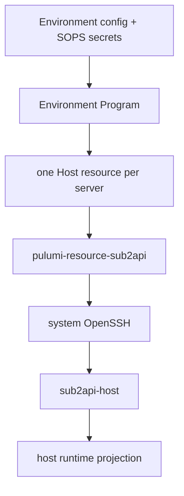

# 001 — Pulumi SSH Controller Tech Spec

状态：Ready for implementation（Terra freeze gate passed）
日期：2026-08-09
实现基线：`main@07ffde499d146f47723f7cf35fbce441d334d883`
配套测试规格：[test-spec.md](test-spec.md)

规范性要求使用 [requirements.yaml](requirements.yaml) 的稳定 requirement ID；所有受管外部副作用使用 [side-effects.yaml](side-effects.yaml) 的稳定 effect ID。两份 manifest 与本文共同构成机器可检查的验收契约，不能只修改 prose 而不更新映射。

<a id="1-conclusion"></a>
## 1. 结论

Sub2API Deploy 将改造成一个由控制机统一运行的 Pulumi SSH Controller。控制机上的 Environment Stack 为每台服务器注册一个 `sub2api:host:Host` resource；Native Provider 使用系统 OpenSSH 调用服务器上的 `sub2api-host`；Host Agent 负责把该服务器的声明投影收敛为 Compose、Traefik、App、Docker PostgreSQL/Redis、MicroSocks、Tunnel connector 和受管网络规则。

本次在一个工作分支连续完成控制机 CLI、Environment Program、Host Provider、Host Agent、legacy 兼容、迁移门禁、测试与旧执行路径退役。实现过程允许保留可回退的小提交，最终交付必须是一条完整可运行的控制链。

Cloudflare、Neon、Upstash provider 的 API 行为与 serverless 资源生命周期不属于本规格的测试对象。Environment Program 可以继续创建或引用这些资源，但 Controller 只接收它们解析后的连接信息与依赖信号；测试只验证 per-Host 投影、Host 顺序和 publication 对 Host readiness 的依赖，不验证云厂商 CRUD、配额、导入格式或实际 API 响应。

## 2. 目标与完成边界

本次完成后，控制机可以用同一套命令管理多台 VPS，并具备：

- Pulumi Preview、state、refresh、import、history 与 dependency graph；
- 系统 SSH alias、known_hosts 和用户现有 OpenSSH 配置的原样复用；
- Host Create、Read、Update、Delete、Import 的稳定语义；
- SSH 返回未知时基于 operation journal 恢复，而不重复执行副作用；
- 远端手工 drift 的可发现、可审查和显式收敛；
- App 蓝绿更新、路由回退、数据模式保护、secret rotation 和安全退役；
- 从旧 per-VPS local Pulumi 到新 Environment Stack 的单 writer 接管。

代码完成以配套测试规格中的 Controller 强制门槛为准。真实生产接管还要求每台 Host 执行 shadow inspect、writer freeze、import、refresh、preview no-op 和观察窗口；生产状态不会在普通代码测试中修改。

## 3. 非目标

本次不实现以下能力：

- PostgreSQL 或 Redis 业务数据复制、备份、恢复和 schema 搬运；
- Sub2API 账号、渠道、动态设置、业务表和人工 proxy record 管理；
- Cloudflare、Neon、Upstash provider 的替身实现或 API contract test；
- Kubernetes、Docker Swarm 或另一套调度器；
- 自研 SSH 协议栈、私钥管理和 known_hosts 管理；
- 普通 `pulumi destroy` 触发持久数据物理销毁；
- 把 App、Traefik、PostgreSQL、Redis、MicroSocks 拆成额外 Pulumi custom resource。

## 4. 现状与迁移动机

当前每台 VPS 各自运行一个 Pulumi Stack，`command.local.Command` 直接在 Pulumi 所在机器执行 Shell、TypeScript 和 Docker Compose。该模型把资源图和远端执行位置绑定在一起：把 Stack 移到控制机后，local Command 会错误地在控制机执行。

仓库已经具备可复用的安全语义：结构化 Host/Site config、数据模式不可普通切换、host/deploy state 原子写入、legacy adoption journal、蓝绿 slot、健康失败回退、Site 隔离、secret dotenv 校验和持久资源 protect/retain。新实现必须逐项迁移这些行为，现有脚本和测试在 Go parity 完成前充当行为基线。

目标执行路径固定为：



## 5. 全局不变量

以下规则优先于局部实现便利：

1. 同一台 Host 同一时刻只有一个 deployment writer；迁移期间旧 Stack 与新 Provider 不得同时可写。
2. 每台服务器恰好一个 `sub2api:host:Host`，Host 内部对象不进入 Pulumi resource graph。
3. `Check`、`Diff` 和普通 Program evaluation 不连接 SSH；`Read` 是 Pulumi refresh 获取远端事实的唯一 Provider lifecycle 入口。
4. SSH alias 是稳定身份的一部分。改 IP 通过 OpenSSH `HostName` 完成，普通配置不能修改 alias/server ID。
5. SSH 结果未知时保留原 operation ID，先查询 journal，再决定继续、失败或人工恢复。
6. Apply、recover 和 retire 的每个持久状态写入都使用临时文件、`fsync`、rename 和 directory `fsync`。
7. 数据目录、Docker volumes、PostgreSQL/Redis 文件和业务表永远不会由普通 Delete、destroy 或 rollback 删除。
8. secret 不出现在 resource ID、hash 原文、journal、stdout、stderr、evidence、普通 state 字段或测试 fixture。
9. PostgreSQL/Redis connection identity 变化必须在任何 render、restart 或 route mutation 之前完成一次性批准校验。
10. Import 只读；Import、Read 和 shadow inspect 不写文件、不调用 Docker mutation、不修改 route。
11. 所有远端命令使用固定 argv；不通过 shell 拼接 alias、路径、operation ID 或配置值。
12. 未知 state、未知 journal phase、协议不兼容、identity 冲突和人工接管对象统一 fail-closed。

### 5.1 Contract limits

外部contract上限固定为数值，测试使用独立golden literal验证边界：

| 项目 | 上限 |
| --- | --- |
| environment config file | 4 MiB |
| servers per environment | 64 |
| apps per environment | 128 |
| apps projected to one Host | 64 |
| Host RPC request | 8 MiB |
| Host RPC response/stdout | 1 MiB |
| SSH/Agent stderr captured | 256 KiB |
| single journal/current/tombstone file | 2 MiB |
| approval file | 64 KiB |
| single evidence bundle | 4 MiB |
| staged Host bundle | 512 MiB |
| operation directory total before new writes fail | 512 MiB |
| retained terminal journals | at least 90 days and latest 128 |

超过上限统一在解析或side effect前失败；日志只报告实际大小与上限，不回显内容。非终态operation和retire tombstone不因quota自动删除，空间不足时阻止新写并进入明确运维错误。

## 6. 代码与发布结构

仓库保持一个 Go module，目标目录如下：

```text
cmd/sub2api-deploy/              # control CLI
cmd/pulumi-resource-sub2api/     # native provider plugin
cmd/sub2api-host/                # remote agent
environment/                     # Environment Pulumi program
internal/config/                 # YAML/SOPS/schema/reference validation
internal/model/                  # canonical model and per-host projection
internal/environment/            # Host ordering and resource registration
internal/provider/               # Host lifecycle implementation
internal/hostrpc/                # strict versioned wire contract
internal/sshtransport/           # system ssh/scp fixed-argv adapter
internal/hostagent/              # inspect/apply/retire/recover state machine
internal/runtime/                # compose/route/data/proxy/firewall adapters
internal/migration/              # legacy state and ownership ledger
pkg/sub2api/                     # generated/handwritten Host Pulumi wrapper
testdata/                        # sanitized states, requests and fault fixtures
docs/specs/001-pulumi-ssh-controller/
```

依赖方向固定为config -> model -> environment/provider；provider只能通过hostrpc/sshtransport访问Agent；hostagent通过命名runtime adapter执行本机动作。边界约束：

| 模块 | 唯一职责 | 禁止 |
| --- | --- | --- |
| `internal/config` | strict YAML/SOPS decode、defaults、引用校验 | Pulumi、SSH、Docker |
| `internal/model` | canonical model、Host投影、DAG、identity/revision | 文件和网络副作用 |
| `internal/environment` | Host注册、opaque upstream输出和dependsOn | SSH、Compose、第二套计划 |
| `internal/provider` | lifecycle、approval、unknown-result、ProxyRegistry编排 | 解析用户YAML、执行Docker |
| `internal/hostrpc` | strict DTO、canonical codec、error/redaction | `os/exec` |
| `internal/sshtransport` | SSH/scp framing、bundle staging、cancel | 业务retry、shell拼接 |
| `internal/hostagent` | identity、journal、inspect/apply/recover/retire | Pulumi、云API、跨Host图 |
| `internal/runtime` | bundle/render/data/app/proxy/firewall/probe step adapter | journal和跨phase编排 |
| `internal/migration` | legacy只读adapter和ownership ledger | 普通reconcile事实源 |
| `cmd/sub2api-deploy` | SOPS、Pulumi CLI包装、evidence | 直接SSH apply、Docker业务逻辑 |

同一 release workflow 构建：

- 控制机 bundle：`sub2api-deploy`、`pulumi-resource-sub2api`、Environment Program；
- Host bundle：Linux amd64/arm64 `sub2api-host` 和 Compose/Traefik 模板；
- `bundle.lock.yaml`：版本、架构、URL、SHA-256 和 protocol compatibility。

最终 Host bundle 不携带 Node、npm、tsx 或 `node_modules`。旧 TypeScript/Shell 只有在对应行为被 Go contract test 覆盖后才删除。

<a id="5-public-config-contract"></a>
<a id="6-environment-stack-resource-graph"></a>
<a id="7-per-host-projection"></a>
## 7. 配置与 Host 投影

公开配置根对象冻结为：

```text
version
cloudflare
reverseProxy
servers
postgres
redis
apps
```

`publicAccess` 和 `outboundProxy` 位于 `apps.<app>`。`servers` 的 key 同时作为稳定 server ID 和 SSH alias。合法 server ID 为 1..63 字符的 ASCII DNS label，首尾只能是小写字母或数字，内部允许 `-`；以 `-` 开头、包含空白/路径字符/Unicode 或能被解释成 option 的值全部拒绝。`secrets.yaml` 镜像普通配置层级，`pulumiPassphrase` 是工具启动需要的顶层例外。

`internal/model` 完成三次转换：

```text
raw YAML
-> validated canonical environment
-> dependency-ordered per-host desired projections
-> HostArgs + secret partitions
```

每个 `HostDesired` 只包含该 Host 实际需要的 App、数据服务、route、proxy 和 connector。一个 Host 不得接收其他 Host 的连接 secret、管理员初始密码或代理凭据。

HostDesired v1结构固定为：

```go
type HostDesired struct {
    SchemaVersion int
    Host          HostDesiredIdentity
    ReverseProxy  *ReverseProxyDesired
    DataServices  []DataServiceDesired
    Apps          []AppInstanceDesired
    Tunnel        *TunnelConnectorDesired
    OutboundProxy *MicroSocksDesired
    Firewall      FirewallDesired
}

type AppInstanceDesired struct {
    AppID             string
    ImageDigest       string
    Role              ReplicaRole // leader | follower, derived from apps.<app>.servers order
    Route             RouteDesired
    Postgres          ConnectionIdentity
    Redis             ConnectionIdentity
    OutboundProxyMode ProxyUseMode
}

type HostDesiredIdentity struct {
    Environment       string
    ServerID          string
    ExpectedOwnerID   string // deterministic Environment/Stack owner, not remote observation
    PublicAddresses   []string
    InternalAddresses []string
}

type ReverseProxyDesired struct {
    ImageDigest string
    ACMEEmail   string
    Routes      []RouteDesired
}

type RouteDesired struct {
    AppID          string
    Hostnames      []string
    TLSMode        string
    DirectProbe    ProbeDesired
    ActiveSlotPath string // derived path, never raw user input
}

type DataServiceDesired struct {
    Name          string
    Kind          string // postgres | redis
    ImageDigest   string
    ComposeProject string
    VolumeIdentity string
    ListenPort    int
}

type ConnectionIdentity struct {
    ResourceID  string
    Endpoint    string
    Port        int
    Database    string
    RedisDB     int
    TLSIdentity string
    ConnectionID string
}

type TunnelConnectorDesired struct {
    ConnectorID string
    ImageDigest string
    Routes      []string
}

type MicroSocksDesired struct {
    ListenAddress string
    ListenPort    int
    RequiredBy    []string
}

type FirewallDesired struct {
    TableName string
    Rules     []FirewallRuleDesired
}
```

`HostDesiredIdentity`只包含Program可由config/Stack identity确定的environment、server ID、addresses和expected owner ID；远端生成的installation ID、observed owner和ownership epoch绝不进入desired。`DataServiceDesired`只描述本机Docker PostgreSQL/Redis；Tunnel与MicroSocks只在本机实际运行时出现。所有map在canonical model中转为按稳定key排序的slice。Compose project、network、container label、slot alias、route path和runtime path由model派生，用户不能直接输入这些名字。

`environment` 与 `serverId` 使用相同的 ASCII DNS-label grammar：长度1..63，首尾为小写字母或数字，内部只允许小写字母、数字和`-`。公开配置的server map key同时是server ID和SSH alias，因此Program与Provider Check都强制`sshAlias == serverId`；不得用第二个alias绕过Host identity。声明但无workload的server是合法bootstrap-only Host，不产生App/data/route/proxy/firewall mutation。

Secrets固定分为：`RemoteSecrets`只包含该Host实际消费的Traefik DNS challenge、App、数据库、Redis、MicroSocks和bootstrap secret；`ControlSecrets`只包含Provider控制侧使用的Admin API等secret，永不进入SSH request。Cloud management token不发远端；Traefik DNS challenge token只发给实际承担证书解析的Host。

App 的 `servers[0]` 是desired leader，其余是follower；`existing`和`AutoSetup`不是desired字段。Program可以把leader的`initialAdminPassword`作为加密Host input投影，但不通过SSH猜测远端状态。Provider只在inspect确认desired role=leader且`NeedsSetup=true`后，才把bootstrap secret与`AUTO_SETUP=true`写入Apply RPC；其余runtime固定`AUTO_SETUP=false`。多个 App 产生的 Host 顺序必须可拓扑排序。

Pulumi preview期间opaque upstream outputs可能是unknown。Program、Check和Diff必须保留unknown/secret wrapper，不能把unknown当空值、计算伪revision或提前报连接字段缺失；Create/Update收到resolved inputs后才要求完整HostDesired。

## 8. Host resource contract

资源 token：`sub2api:host:Host`
资源 ID：`host/v1/<environment>/<server-id>`

```go
type HostArgs struct {
    Environment    string          `pulumi:"environment"`
    ServerID       string          `pulumi:"serverId"`
    SSHAlias       string          `pulumi:"sshAlias"`
    Bundle         BundleRef       `pulumi:"bundle"`
    Desired        HostDesired     `pulumi:"desired"`
    RemoteSecrets  HostSecrets     `pulumi:"remoteSecrets" provider:"secret"`
    ControlSecrets ControlSecrets  `pulumi:"controlSecrets" provider:"secret"`
}

type HostState struct {
    HostArgs
    InstallationID           string            `pulumi:"installationId"`
    ObservedOwnerID          string            `pulumi:"observedOwnerId"`
    ObservedOwnershipEpoch   uint64            `pulumi:"observedOwnershipEpoch"`
    ProtocolVersion int               `pulumi:"protocolVersion"`
    DesiredRevision           string            `pulumi:"desiredRevision"`
    AppliedDesiredRevision    string            `pulumi:"appliedDesiredRevision"`
    ObservedRevision          string            `pulumi:"observedRevision"`
    CommittedObservedRevision string            `pulumi:"committedObservedRevision"`
    RegistryRevision          string            `pulumi:"registryRevision"`
    CommittedRegistryRevision string            `pulumi:"committedRegistryRevision"`
    RegistryDesiredRevision   string            `pulumi:"registryDesiredRevision"`
    AppliedRegistryDesiredRevision string        `pulumi:"appliedRegistryDesiredRevision"`
    SecretRevision  string            `pulumi:"secretRevision"`
    RuntimeVersion  string            `pulumi:"runtimeVersion"`
    Health          HostHealthSummary `pulumi:"health"`
    ReadyForPublication bool            `pulumi:"readyForPublication"`
    Drifted         bool              `pulumi:"drifted"`
    RegistryDrifted bool              `pulumi:"registryDrifted"`
    LastOperationID string            `pulumi:"lastOperationId"`
}
```

`DesiredRevision` 是当前 bundle + 非敏感 HostDesired 的 canonical revision；`AppliedDesiredRevision` 是上次成功 commit 的 desired revision，用于判断输入变化。`ObservedRevision` 是 inspect 对稳定、受管 runtime observation 的 revision；`CommittedObservedRevision` 是上次成功 commit 后记录的 observation revision，两者不同才表示 managed drift。瞬时 health、时间戳、container ID、restart count 和 probe latency 不参与 observed revision。`SecretRevision` 由 Host master key 派生的`secret-revision-v1` key对生成secret文件的规范化内容计算，不能用于离线猜测secret。

Create/Import/Update用prior state与Inspect校验`InstallationID/ObservedOwnerID/ObservedOwnershipEpoch`。takeover把expected owner transition放在一次性approval和migration ledger precondition中；epoch提升只更新remote ownership/state output，不要求Program读取ledger或第二份desired metadata。首次bootstrap、program-first import、epoch提升后的preview和旧checkpoint重放都必须可由同一公开config求值。

Pulumi state 不保存 Docker inspect 原文、Compose env、DSN、stdout/stderr、journal 正文、approval 文件或 Admin API key 的可打印副本。

Native Provider固定使用`github.com/pulumi/pulumi-go-provider` v1.4.1的`infer.Provider`实现，版本锁在`go.mod/go.sum`；schema由同一组Go类型生成并保存golden。Provider integration使用该版本的integration harness，不能另写一套property语义。

Provider schema将`remoteSecrets`和`controlSecrets`的全部nested property标记为secret。Read/Import无法从Host回读这些值，只能沿用Program提供、仍带secret taint的inputs并更新非敏感outputs；stack export测试必须证明HostArgs嵌入state不会把secret降级为普通output。ControlSecrets rotation与远端SecretRevision分别比较，不能合并成一个revision。

## 9. Provider lifecycle

<a id="91-check"></a>
### 9.1 Check

`Check` 只做 schema decode、默认值、canonicalization、Host ID/alias 格式、secret partition 和不可变字段校验。未知字段、引用缺失、循环依赖和 alias 改变返回结构化 failure。该方法不 SSH、不读远端文件、不调用 cloud API。

<a id="92-diff"></a>
### 9.2 Diff

`Diff` 比较新 inputs 与 Pulumi state。bundle/desired/new remote secret input变化、`DesiredRevision != AppliedDesiredRevision`、`Drifted=true`、`RegistryDesiredRevision != AppliedRegistryDesiredRevision`或`RegistryDrifted=true`都返回in-place update。Diff无法计算Host-local SecretRevision，只比较old/new Pulumi secret input的opaque property equality。Host不支持自动replacement。

Diff 不执行 inspect。需要远端事实时由用户显式运行 `refresh` 或 `preview --refresh`。

<a id="93-create"></a>
### 9.3 Create

Create 要求 agent 已通过显式 bootstrap 安装。Provider 先 inspect：

- 空 Host 或只有已验证 bootstrap marker：允许创建；
- legacy runtime 且携带精确 adoption intent：进入 adoption apply；
- 已由相同 Host ID 管理且 desired 一致：恢复为幂等成功；
- 被其他 environment/Host ID 管理、state 冲突或身份不明：拒绝。

matching managed Host即使只有drift也拒绝普通Create；已有runtime必须走program-first Import或携带精确adoption intent，不能由Create自行选择接管策略。

Create 调用 Agent 的原子 begin-or-resume 协议，在任何副作用前获得已经持久化的 operation identity，随后调用 apply，并在返回后再次 inspect。Provider 不负责下载未知脚本或执行 `curl | sh`。

<a id="94-read"></a>
### 9.4 Read

Read总是调用Agent `inspect --stdio`。只有control desired启用受管proxy record时才并行调用`ProxyRegistry.ReadOwned`；disabled时四个registry revision使用固定sentinel`registry-disabled/v1`、`RegistryDrifted=false`且`registry-ready=true`，不要求ControlSecrets也不调用Registry。Provider验证Host/local observation和record ownership，并用`local-ready && registry-ready`重算`ReadyForPublication`。

- present + healthy/no drift；
- present + drift；
- present + pending operation；
- recovery-required；
- unreachable/timeout/protocol error；
- confirmed retired tombstone。

网络不可达、host key 错误和协议错误不会返回 resource missing。只有 Agent 返回 Provider-owned completed retire tombstone，Provider 才确认远端生命周期已经结束。management marker、host state、agent binary或route被手工删除都属于 recovery-required，不能让 Read 返回 NotFound。

ProxyRegistry不可达时Read保留resource ID并返回结构化error。已应用过record时，owned record缺失/被篡改使`RegistryRevision != CommittedRegistryRevision`并派生`RegistryDrifted=true`；从未应用但desired启用的absent record保持observation baseline，靠`RegistryDesiredRevision != AppliedRegistryDesiredRevision`触发repair。Read永不创建、修改或删除record。

Read遇到recovery-required返回结构化error并保留旧Pulumi checkpoint ID；诊断写入脱敏evidence，Read不提交一个含糊的半更新state，也不执行repair。

<a id="95-update"></a>
### 9.5 Update

Update 固定执行：

```text
inspect Host and current transition
-> validate expectedAppliedDesiredRevision and identity
-> validate one-time approvals
-> begin-or-resume the same request
-> apply/resume the Agent-owned operation
-> recover unknown result with same operation ID
-> reconcile/read-after-unknown owned ProxyRegistry records
-> final inspect and combine local-ready + registry-ready
-> commit Pulumi outputs
```

如果 inspect 发现另一个非终态 operation，Provider 不启动新操作。相同 intent 可以进入 recover；不同 intent 要求先显式 `recover-host` 或人工处理。

只有ControlSecrets或control-side proxy record变化时，Provider跳过Agent写操作。enabled/changed执行ReadOwned+UpsertOwned；enabled→disabled先ReadOwned验证ownership，再DeleteOwned并read-after-unknown，确认absent后才把四个registry revision提交为`registry-disabled/v1`。该普通in-place Update不需要retire approval，但绝不删除unowned record。只有remote desired/secret或managed drift变化才进入Agent begin-or-resume。

Operation ID 不能只存在 Provider 内存或等待成功后写入 Pulumi state。Agent 维护原子 `current-transition.json`：收到写请求后，先用`request-fingerprint-v1`派生key对action、Host/owner epoch、precondition、desired、bundle、remote secret revisions和approval subject计算request fingerprint；在writer lock内查找或创建operation，并在任何副作用前fsync operation ID、fingerprint和intent。相同request自动返回或恢复同一operation；不同request遇到非终态transition时拒绝。

Provider plugin崩溃、Pulumi CLI重启或 Update 未提交 state时，新进程从旧 state和相同 inputs先inspect current transition，再重发相同请求或按已知ID recover，Agent找回原operation。terminal complete返回原结果；terminal failed不会自动创建下一operation，必须经过显式`recover-host`或`--retry-failed-operation <id>`并创建带predecessor的successor。`BaseIntentFingerprint`只包含approval subject，不含approvalId/nonce/signature，用于无proof定位current transition；`BoundOperationFingerprint`在operation创建时再绑定approvalId。journal保存两者与approvalId，不保存raw nonce或signature。

Current transition后继规则固定为：

| current state | incoming intent | 行为 |
| --- | --- | --- |
| absent | 任意合法intent + 必要proof | 原子创建operation |
| running | 相同fingerprint | resume同一operation |
| running | 不同fingerprint | conflict，零新journal |
| complete | 相同fingerprint且observation仍匹配 | 返回缓存结果 |
| complete | 不同fingerprint或新的drift precondition | 原子创建successor并记录predecessor |
| failed + rollback complete | 相同fingerprint | 返回原失败；只有显式retry可创建successor |
| failed + rollback complete | 不同fingerprint | 当前observation等于rollback结果时允许普通successor，否则recovery-required |
| recovery-required | 任意apply | 阻断，只允许recover |
| retired tombstone | create/update | 阻断；Topic 001不实现re-adopt |

切换current pointer与创建successor journal在同一个writer lock和durable transaction中完成。complete journal已经按保留策略清理时，bounded transition index仍提供fingerprint、terminal result、observation和predecessor，连续A→B→C更新不会丢失因果链。

<a id="96-delete"></a>
### 9.6 Delete

生产Host与可能detach该Host的publication resource默认`protect: true`，持久data resource继续protect+retain。用户先在唯一公开config中解除五类引用并删除server；`retire-host`从旧checkpoint、ownership ledger和approval读取旧Host identity，不使用临时desired overlay。

退役控制侧事务固定为：

```text
planned
-> lease-acquired
-> checkpoint-exported
-> approval-bound-control
-> unprotected
-> successor-plan-saved
-> publication-detached
-> registry-deleted
-> host-retired
-> surviving-urns-reprotected
-> complete
```

CLI取得environment-scoped durable lease，导出加密checkpoint并记录backend version/digest，然后在control ledger把retire `approvalId + Host + owner epoch + old checkpoint Host fingerprint + checkpoint digest`原子绑定；这是publication发生前的授权消费authority。ledger固定在`$XDG_STATE_HOME/sub2api-deploy/transactions/<environment>.json`，parent 0700/file 0600，使用同目录atomic write、file/dir fsync和environment lock；控制机备份必须连同Pulumi backend恢复，所有Controller mutation先检查ledger。随后只unprotect allowlist URN，在新checkpoint上运行`pulumi preview --save-plan`，通过公开JSON event stream验证`URN + allowed op + allowed changed paths`；saved plan为0600 secret工件，只保留digest。

`pulumi up --plan`先detach publication；Host.Delete再`ProxyRegistry.DeleteOwned`并read-after-unknown，最后Agent将同一approvalId绑定到retire operation并执行远端退役。Delete只有同时满足以下条件才进入该顺序：

- CLI 注入当前 environment/Host/desired fingerprint 对应的一次性 retire approval；
- config/model 已证明没有 App、data、public access、outbound proxy 引用；
- publication 已解除，受管control-side proxy record可由当前Host ownership安全删除；
- Host 没有非终态 operation。

远端固定执行 `retire --preserve-data`：停止并删除owned App、Traefik、MicroSocks、Tunnel以及owned PG/Redis containers和非持久network，移除owned route/nftables和generated runtime credential；Docker volumes、bind data/inode、old releases、master key和operation evidence保留。

update后CLI重新protect所有仍存在的获批URN并read-back。不能只依赖进程内`finally`：每条后续Controller mutation先读取lease/ledger，若上次停在任一非终态则先reprotect surviving URN、核对backend version并refresh。若partial update改变checkpoint，旧plan作废；ledger从最新checkpoint生成只包含剩余allowlist操作的successor plan，记录`predecessorPlanDigest`和新checkpoint digest，不能盲目重放旧plan。backend version被外部writer改变时立即停止并尽力reprotect；拥有backend权限且故意绕过Controller的管理员属于可信边界，Controller只检测并fail-closed。Provider Delete再次验证control binding、Agent approval、identity与record ownership。

<a id="97-import"></a>
### 9.7 Import

Import ID 必须精确匹配 `host/v1/<environment>/<server-id>`，并采用 program-first import：Program 先用完整、secret-tainted Host inputs注册 resource，再通过临时 Import option/import file让 Provider执行 Read。Provider无法也不会从远端重建 RemoteSecrets/ControlSecrets。Import 只执行inspect、`ProxyRegistry.ReadOwned`和state construction，不调用apply、render、Docker/route/record mutation或secret rewrite。

matching import固定构造：`DesiredRevision=program desired`、`AppliedDesiredRevision=远端已应用desired的可验证revision`、`ObservedRevision=current observation`、`CommittedObservedRevision=current observation`、`RegistryDesiredRevision=program control desired`、`AppliedRegistryDesiredRevision=已验证owned record的desired revision`、`RegistryRevision=current registry observation`、`CommittedRegistryRevision=current registry observation`、`Drifted=false`。matching desired record为no-op；owned record absent/stale时Import成功但`RegistryDesiredRevision != AppliedRegistryDesiredRevision`使后续Diff显示repair；unowned collision与无法可靠重建AppliedDesiredRevision/record ownership时Import失败。不能把desired diff伪装为runtime drift。

Host wrapper为Create/Update/Delete注册默认Pulumi CustomTimeouts 30/30/20分钟；Read/Import不支持CustomTimeouts，固定使用Provider内部2分钟deadline并尊重engine context。SSH connect timeout为10秒且包含在整体deadline内。context cancel贯穿Provider、SSH、Agent和child process；cancel不代表远端未执行，下一次调用仍从current transition恢复。

<a id="10-system-openssh-transport"></a>
## 10. System OpenSSH transport

普通 lifecycle 的 argv 固定为：

```text
ssh -T -a -x -o BatchMode=yes -o ConnectTimeout=<seconds> -o StrictHostKeyChecking=yes -o CheckHostIP=no -o UpdateHostKeys=no -o PermitLocalCommand=no -o ClearAllForwardings=yes -o ForwardAgent=no -o ForwardX11=no -o Tunnel=no -o ControlMaster=no -o ControlPath=none -o ControlPersist=no -o SendEnv=-* -- <alias> sudo -n -u sub2api-deploy -- /usr/local/bin/sub2api-host inspect --stdio
ssh -T -a -x -o BatchMode=yes -o ConnectTimeout=<seconds> -o StrictHostKeyChecking=yes -o CheckHostIP=no -o UpdateHostKeys=no -o PermitLocalCommand=no -o ClearAllForwardings=yes -o ForwardAgent=no -o ForwardX11=no -o Tunnel=no -o ControlMaster=no -o ControlPath=none -o ControlPersist=no -o SendEnv=-* -- <alias> sudo -n -u sub2api-deploy -- /usr/local/bin/sub2api-host apply --stdio
ssh -T -a -x -o BatchMode=yes -o ConnectTimeout=<seconds> -o StrictHostKeyChecking=yes -o CheckHostIP=no -o UpdateHostKeys=no -o PermitLocalCommand=no -o ClearAllForwardings=yes -o ForwardAgent=no -o ForwardX11=no -o Tunnel=no -o ControlMaster=no -o ControlPath=none -o ControlPersist=no -o SendEnv=-* -- <alias> sudo -n -u sub2api-deploy -- /usr/local/bin/sub2api-host retire --stdio
ssh -T -a -x -o BatchMode=yes -o ConnectTimeout=<seconds> -o StrictHostKeyChecking=yes -o CheckHostIP=no -o UpdateHostKeys=no -o PermitLocalCommand=no -o ClearAllForwardings=yes -o ForwardAgent=no -o ForwardX11=no -o Tunnel=no -o ControlMaster=no -o ControlPath=none -o ControlPersist=no -o SendEnv=-* -- <alias> sudo -n -u sub2api-deploy -- /usr/local/bin/sub2api-host recover --stdio
ssh -T -a -x -o BatchMode=yes -o ConnectTimeout=<seconds> -o StrictHostKeyChecking=yes -o CheckHostIP=no -o UpdateHostKeys=no -o PermitLocalCommand=no -o ClearAllForwardings=yes -o ForwardAgent=no -o ForwardX11=no -o Tunnel=no -o ControlMaster=no -o ControlPath=none -o ControlPersist=no -o SendEnv=-* -- <alias> sudo -n -u sub2api-deploy -- /usr/local/bin/sub2api-host stage-bundle --stdio
```

Transport 使用 `exec.CommandContext` 和 argv slice，不启动本地 shell。OpenSSH会把destination后的远端命令作为字符串交给远端shell，因此该字符串完全固定，不包含alias之外的用户输入；desired、secret、operation request全部走stdin。Provider不读取私钥，不修改SSH config/known_hosts。安全值全部在执行argv强制覆盖，不能只依赖先前`ssh -G`，从而避免config变更TOCTOU。validate与Provider direct path仍读取`ssh -G`最终结果：`StrictHostKeyChecking=no/accept-new`、任意SetEnv和LocalCommand直接拒绝；yes/ask、HostName、User、Port、IdentityFile、IdentityAgent和ProxyJump可以使用。OpenSSH config、Include、Match exec和ProxyCommand/ProxyJump属于操作者可信本地代码边界，Controller不把不可信SSH config当作sandbox输入。

SSH子进程环境白名单只有`PATH`、`HOME`、必要locale以及可选`SSH_AUTH_SOCK`。SSH agent明确受支持，但socket必须存在、为Unix socket、由当前UID拥有且不可被group/other写；不满足时validate返回`unsafe-ssh-agent`。除该单项外不复制认证或secret环境，Pulumi passphrase、SOPS/cloud token和Admin API key永不继承。ControlMaster/ControlPersist始终关闭，即使用户已有active master也不复用。

stdout 设定上限并只允许一帧 JSON。空输出、多帧、前后日志、截断、超限和非法 UTF-8 都是协议错误。stderr 设独立上限，只进入结构化脱敏诊断，原文不进入 Pulumi state。ConnectTimeout只管连接阶段，所有 RPC另有整体 deadline。Context cancel后 Provider终止整个本地SSH/ProxyCommand process group；只要写请求可能已经发送，结果就归类为 unknown，随后以同一请求触发Agent begin-or-resume。

`sub2api-deploy validate` 独立执行 `ssh -G <alias>` 和 BatchMode 连通检查。Check/Diff 不复用该网络行为。

服务器alias可以继续登录现有admin用户，但bootstrap前置条件固定为该用户可执行`sudo -n`；不满足时要求操作者先按文档配置sudo，Controller不收集密码。bootstrap创建system user/group `sub2api-deploy`，将其加入docker group，并把实际UID/GID写入root-owned `installation.json`，后续每次validate核对。普通RPC通过sudoers精确允许resolved SSH user以`sub2api-deploy`身份运行`/usr/local/bin/sub2api-host`。

同一个Host binary以root-owned symlink `/usr/local/libexec/sub2api-host-root`进入root-helper mode，sudoers只允许`sub2api-deploy`运行`install-release --stdio`和`apply-firewall --stdio`两个固定子命令。helper从stdin接收strict JSON、重新校验SHA/arch/path containment和owned nftables table，不接受任意command/path shell参数。`/opt/sub2api/releases`、两个symlink和sudoers由root拥有且0755/0440；`/var/lib/sub2api`为root:`sub2api-deploy` 0750，`identity/installation.json`与`identity/ownership.json`为root:group 0640，Agent可写的`state/`、`inbox/`、`runtime/`由记录的UID/GID拥有且0700，secret/journal文件0600。Docker socket权限本身等价于主机高权限，这一威胁边界明确记录；root helper仍用于保护root-owned release、sudoers和host firewall，不能扩展成通用shell。

权限错误使用稳定code：SSH用户无`sudo -n`为`sudo-denied`，installation记录UID/GID不符为`identity-permission-mismatch`，Docker socket不可用为`docker-permission-denied`，root helper命令或sudoers拒绝为`root-helper-denied`。这些错误在任何runtime副作用前返回；Read保留resource ID。

<a id="11-bootstrap-and-bundle"></a>
## 11. Bootstrap 与 bundle

`sub2api-deploy bootstrap-host <environment> <server>` 是唯一 Agent 安装入口：

1. 从 `bundle.lock.yaml` 选择目标 arch；
2. 下载或读取 control bundle 中的 Host artifact；
3. 本地校验 SHA-256；
4. 用与lifecycle完全相同的严格host-key/forwarding/multiplexing/cancel选项执行系统`scp`，上传到resolved SSH user拥有的0700 bootstrap目录中的128-bit随机临时文件；
5. 通过固定remote-command模板执行该独立bootstrap artifact的`sudo -n -- ~/.cache/sub2api-bootstrap/<32-hex> bootstrap --stdio`；remote shell只展开`~`，唯一插值是Controller生成并严格校验的32位小写hex。stdin携带environment、Host、expected SHA、issuer public key和目录policy，artifact先lstat自身/parent、核对owner/mode与SHA，再创建user/sudoers/root helper/release；bootstrap期间resolved SSH admin user及其免密sudo属于显式可信边界；
6. 原子更新 `/usr/local/bin/sub2api-host`；
7. 执行只读 version/inspect 验证。

bootstrap 只安装 Agent 和 management bootstrap marker，不创建 App、数据库、route、proxy 或 firewall rule。重复安装相同 SHA 为 no-op；目标路径已有不同内容、arch 不符或 checksum 不符时 fail-closed。

bootstrap temp path不进入普通RPC；scp destination与remote-command都使用相同`~/.cache/sub2api-bootstrap/<32-hex>`模板。bootstrap同时把resolved SSH admin user加入`sub2api-deploy` group，并建立`/var/lib/sub2api/inbox-upload` root:`sub2api-deploy` 2730（setgid）；本地nonsecret artifact固定0640，后续新SSH session使用严格`scp -p`，partial继承目录group并保留0640。bootstrap完成后删除temp；任一中断重连后先inspect固定installation marker/release SHA，再决定复用或清理owned temp。scp与bootstrap SSH都使用整体deadline、process-group kill和最小environment。

普通bundle上传不依赖operation ID。Provider用严格系统scp把archive写入`/var/lib/sub2api/inbox-upload/<32-hex>.partial`，随后调用`stage-bundle --stdio`；Agent核对basename grammar、regular-file/no-link、resolved uploader UID、group/mode、size/SHA/arch和quota后，在同一filesystem原子rename到`/var/lib/sub2api/inbox/sha256/<bundle-sha>`。重复上传同digest为no-op，冲突或超限fail-closed；该动作没有business runtime副作用。

Apply创建operation后，`stage-bundle` phase只引用并提升该digest：root helper重新验证SHA、arch、bundle format和protocol，再原子移动/复制到`/opt/sub2api/releases/<sha>`。兼容性通过后切换`/usr/local/bin/sub2api-host`；当前已启动Agent进程完成当前operation，symlink只影响下一次RPC，不实现进程间handoff。Agent不会自行curl外部URL。

<a id="12-host-rpc-v1"></a>
## 12. Host RPC v1

stdin 一条 request，stdout 一条 response，decoder 启用未知字段拒绝。共同 envelope：

```json
{
  "protocolVersion": 1,
  "kind": "apply",
  "operationId": "",
  "hostId": "host/v1/production/app-1"
}
```

`kind` 固定为 `inspect | stage-bundle | apply | retire | recover | version`。`stage-bundle`是已安装Agent的transport-only command：request携带inbox temp basename、bundle SHA/size/arch，Agent在inbox lock下lstat/hash并原子rename到content-addressed final path，不创建business operation。首次apply/retire的operationId可以为空，Agent begin-or-resume原子创建随机128-bit ID，grammar固定为`op_<26-char lowercase base32>`；fingerprint才是HMAC。已知ID的恢复请求必须携带它。

首次begin request不携带权威request fingerprint；Provider也没有Host-local key可生成它。Agent在writer lock内计算`BaseIntentFingerprint`并匹配current transition；创建新operation且需要approval时，再从base fingerprint与verified approvalId计算`BoundOperationFingerprint`。response返回两者的opaque值和operation ID。已知ID的recover可携带lookup hint，但Agent始终重算核对。Provider未收到response或proof已丢时先inspect current transition，以base fingerprint定位已绑定operation/approvalId，再按operation ID recover；只有current不存在时才用仍有效proof开始新operation。

Approval由CLI的environment-scoped Ed25519 issuer签发；bootstrap把issuer public key和key ID写入root-owned installation policy，私钥只在控制机SOPS secret中。nonce为CSPRNG 128-bit、grammar为32字符小写hex；`approvalId`对versioned length-delimited canonical encoding的`issuerKeyId,nonce`计算SHA-256，禁止裸拼接。claim绑定environment、Host、App/resource、old/new identity、action、issuedAt、expiresAt和最大30秒clock skew。Agent验签后，在writer lock内把approvalId与新operation原子写入durable consumption store；BaseIntentFingerprint不含approvalId，BoundOperationFingerprint包含它。

同一operation可在proof文件丢失或expiry之后依据已绑定approvalId恢复；successor必须使用不同approvalId。CLI父进程保留0600 proof临时文件直到Pulumi子进程退出，不能在Provider读取后立即删除；只有Agent持久绑定才算消费。Agent持久化`lastSeenWallTime`，时钟倒退超过30秒即fail-closed；有效区间为`[issuedAt-skew, expiresAt)`，expiry精确时刻无效。两个proof并发绑定同subject时只允许第一个operation成功。

协议兼容固定为Provider和Agent都声明`minProtocol=1,maxProtocol=1`、`bundleFormatVersion=1`。v1 request/response拒绝unknown field、duplicate key和future required enum；只读`version`可探测不兼容端，任何mutation前必须双方范围相交且bundle format为1。升级方向固定为先上传向后兼容Agent bundle、由旧进程完成当前operation、下一RPC使用新binary；不支持自动downgrade或跨major handoff。

状态码分类：

| 类别 | 例子 | Provider 行为 |
| --- | --- | --- |
| `invalid-request` | schema、identity、fingerprint 不符 | 确定失败，不重试 |
| `precondition-failed` | applied hash、approval、writer 冲突 | 确定失败，重新 preview/recover |
| `operation-running` | 相同或其他 operation 持锁 | 查询原 journal，不新建操作 |
| `recovery-required` | checkpoint 与 observation 无法自动判定 | 显式 recover-host |
| `runtime-failed` | health、Compose、route 失败且已回退 | 确定失败，保留 evidence |
| `transport-unknown` | SSH EOF/timeout/cancel | 已知ID则inspect该ID；未知ID则inspect current transition或重发相同intent |

<a id="13-operation-journal"></a>
## 13. Operation journal

每台 Host 使用一个 writer lock。journal 路径为 `/var/lib/sub2api/state/operations/<operation-id>.json`，文件权限 0600，内容不含 secret。固定 phase：

```text
intent
validate
stage-bundle
render
data-preflight
reconcile-data
reconcile-app
reconcile-proxy-local
local-health
local-ready
commit
complete
```

上述12项是Apply phase；Retire固定为`intent -> validate -> retire-runtime -> retire-secret-cleanup -> retire-tombstone -> commit -> complete`，Recover不创建独立业务phase，只恢复原operation的同一phase或创建显式retry successor。Provider侧ProxyRegistry effect使用独立control ledger，不伪装成Agent journal phase。

每个 phase 记录 request fingerprint、进入时间、完成时间、非敏感 before/after observation 和可恢复 checkpoint。每个外部side effect进一步执行 intent -> observe -> act -> verify -> complete；Agent在动作前持久化intent，恢复时先observe再决定是否act，不能只依赖“命令返回0”推断结果。

恢复规则：

- 相同 ID + 相同 fingerprint：从 checkpoint 和 observation 继续；
- 相同 ID + 不同 fingerprint：拒绝；
- journal complete：返回缓存的非敏感成功摘要；
- journal failed 且 rollback complete：返回确定失败；
- journal 截断、未知 phase、Host ID 不符：`recovery-required`；
- journal 缺失但远端可能已经发生副作用：`recovery-required`，不猜测成功或失败。

`recover` 只能执行规格中列明的可证明动作，例如根据现存 route/slot observation 补写 checkpoint、恢复旧 route、继续已 staged 的相同 bundle。删除 journal、删除数据或用新 operation 覆盖旧 intent 不属于自动恢复。

跨进程恢复是强制能力：Provider在任何写操作前先inspect current transition；未知结果时重发同一request，Agent begin-or-resume命中相同fingerprint和operation。即使远端已经complete、SSH回包丢失、旧plugin随后崩溃，新plugin也会命中同一complete journal并返回原非敏感结果。这个流程必须由两个独立Provider/Pulumi process和进程外PersistentFakeAgent验证。

远端状态文件固定拆分为：`installation.json`保存bootstrap创建的不可变installation/Host identity，`host.json`保存owner epoch、applied desired revision、committed observation、apps和connection IDs，`current-transition.json`保存唯一当前transition指针，`operations/*.json`保存单次operation，`retired.json`保存preserve-data tombstone。inspect只读，不自动升级legacy state。

terminal journal至少保留90天且始终保留最近128个；非终态永不自动删除，retire tombstone关联operation永久保留。清理前把terminal结果摘要写入容量512的bounded transition index，以便延迟重试仍能确认已经完成的target。索引按terminal完成时间淘汰最旧非retire记录；index miss、corrupt、write/fsync失败一律`recovery-required`，不得把超晚重试当作新operation。

[side-effects.yaml](side-effects.yaml)逐项冻结每个受管外部副作用的owner、phase、intent、observe、act、verify、idempotency key与recovery。生产step没有对应effect ID或effect没有故障测试映射时CI失败。

<a id="14-host-agent-reconcile"></a>
## 14. Host Agent reconcile

Agent 先把 `HostDesired` 编译为 `RuntimePlan`，随后执行以下顺序：

```text
validate identity and paths
-> stage immutable bundle
-> render generated files in staging root
-> validate data link approvals
-> reconcile Docker PG/Redis if selected
-> reconcile Traefik edge runtime and local health
-> reconcile app bootstrap leader or blue/green release
-> reconcile MicroSocks, Tunnel connector and owned firewall table
-> local direct health
-> commit route/generated state
-> return local-ready
```

所有路径先 canonicalize 并验证 containment。generated config 在 staging root 完整生成，通过语法和引用检查后原子替换。远端 runtime state 只保存非敏感 identity、active/previous slot、image digest、data mode/connection ID、route revision、secret revision 和 operation reference。

Traefik必须在App route切换前healthy；Tunnel/MicroSocks/firewall在`local-ready`前完成。ObservedRevision包含owned Traefik/Tunnel image、config、route与ownership projection，local readiness包含Traefik config/health、App direct health、required proxy/connector local health。任一步失败按对应effect checkpoint恢复或回退，Host不能进入local-ready。

<a id="141-app-update"></a>
### 14.1 App 更新

首次安装使用 blue slot；已有 App 使用 inactive slot。更新前先observe并停止仅属于本App的inactive slot，再从active slot复制非敏感`config.yaml`和`.installed`初始化marker到staging，验证ownership/mode/hash后原子安装；secret文件单独重建，不复制。随后Agent启动inactive slot、执行本地健康检查、原子更新Traefik route、验证direct origin，再drain旧slot。route或健康失败时恢复原route，停止失败slot，保留原active slot和数据。停止inactive、复制marker、启动、route和stop-old分别是可checkpoint step。

Agent不执行public DNS/LB/Tunnel endpoint probe，因为publication在资源图上依赖Host local readiness；把public probe放进Agent会形成启动闭环。当前Shell中的public probe迁到`sub2api-deploy up`完成后的只读verification，并在legacy parity清单中标为有意行为变化。

<a id="142-data-services"></a>
### 14.2 数据服务

Docker PostgreSQL/Redis 可以由 Host Agent启动和停止，但 volume/data 永久保留。external/managed 连接以已解析 connection inputs 输入 Host；Agent 不调用 serverless provider API。data mode 或 connection identity 变化必须有一次性批准。

<a id="143-microsocks"></a>
### 14.3 MicroSocks

Agent 管理远端进程、credential file、本地 probe 和本工具拥有的 nftables table。控制机 Provider通过单独 `ProxyRegistry` interface管理固定命名前缀的Sub2API proxy record；Admin API key永不进入Agent。Provider在Agent local-ready后执行幂等upsert/read；enabled→disabled执行owned delete/read-after-unknown并提交disabled sentinel。local-ready与registry-ready共同形成Host ready-for-publication。手工record、账号binding、policy、expiry和fallback不进入所有权范围。

<a id="15-connection-identity-and-approval"></a>
## 15. Connection identity 与批准

PostgreSQL connection ID 由 provider/resource identity、host、port、database、TLS server identity 等非敏感字段计算；Redis 额外包含 DB number。密码、token 和证书私钥不参与 connection ID。

一次性批准采用§12冻结的Ed25519 proof。CLI在当前进程私有0600临时文件保存proof，父进程保留到Pulumi退出；Provider验证claim结构和签名后把完整proof发送Agent，Agent才是durable consumption authority。Pulumi inputs/state、普通日志和operation journal不保存签名或raw proof，journal只保存subject hash、approvalId、issuer key ID和绑定结果。

批准有效区间、clock skew、倒退门禁、并发消费与跨重启恢复全部按§12执行。在Agent绑定前的Provider/SSH失败不消费approval；绑定后的失败只能恢复原operation。失去临时文件不妨碍已绑定operation恢复，但无法创建successor。

bootstrap生成`/var/lib/sub2api/identity/host-master.key`，owner固定为记录的`sub2api-deploy` UID/GID、mode 0600；root helper不读取或返回key，只有Agent UID可读。通过HKDF-SHA-256和固定label分别派生`secret-revision-v1`、`request-fingerprint-v1`与`approval-binding-v1`，后者MAC durable approval binding record，禁止跨用途复用。master key异常返回recovery-required，普通Update不能重建或覆盖secret。Topic 001不实现`rekey-host`或`re-adopt`。

没有批准时，Provider 可以返回明确 Diff，Update 必须在 render、Docker 和 route side effect 前失败。

<a id="16-cli-contract"></a>
## 16. CLI contract

`sub2api-deploy` 是薄控制层，主要命令：

```text
validate <env>
preview <env> [--refresh]
up <env>
refresh <env>
bootstrap-host <env> <server>
import-host <env> <server>
recover-host <env> <server> <operation-id>
retire-host <env> <server>
render-legacy <env> <server>
```

CLI 固定工作目录、backend、SOPS secrets、Provider plugin path 和默认 `--parallel 1`，并把实际 Pulumi argv 与脱敏摘要打印出来。CLI 不解析或重写 Pulumi preview 计划来伪造结果。

`up` 运行前执行 config、ownership ledger、SSH alias 和 pending journal preflight；运行后执行只读 Host readiness 汇总。serverless public endpoint 的真实可用性不属于 Controller test suite。

<a id="17-legacy-takeover-and-writer-freeze"></a>
## 17. Legacy 接管与 writer freeze

迁移 adapter 读取旧 `runtime/host-state.json`、Site deploy state、bootstrap marker 和 adoption journal，将其转换为新 observation。它不在普通 apply 中长期双写新旧 layout。

ownership ledger 至少记录 old stack、old URN/type、physical ID、Host、old writer status、new resource ID、owner identity、ownership epoch、import status 和 evidence hash。进入 Host import 前，旧 Stack 被切换为 preview/export-only；如果 ledger 显示 old writer 仍可 up/destroy/refresh，新 CLI 拒绝写入。

CLI/backend lock不足以阻止另一Stack或旧bundle直接写Host，因此新旧执行路径共享远端mutation lock和ownership epoch。[legacy-bridge.yaml](legacy-bridge.yaml)枚举所有旧mutation entrypoint、caller graph、checkpoint与effect ID。最外层脚本获取lock并通过继承FD+随机bridge token传给嵌套脚本；nested验证FD仍指向同一inode、token和epoch，不再次flock；直接调用内部脚本时自行获取lock。每个实际effect前重读ownership epoch，exit/signal关闭FD。takeover前必须由old owner安装固定SHA bridge release并通过entrypoint scan attestation；无法证明全部入口已覆盖时只能停止并禁用旧writer，不得提升epoch。新Agent owner/epoch只来自`ownership.json`，`installation.json`保持不可变。

共同锁固定为`/var/lock/sub2api-deploy/host.lock`：目录root:`sub2api-deploy` 0770，锁文件0660，旧writer必须以root或该group成员运行。writer从首次precondition检查到最后state/journal commit始终持有同一inode的exclusive flock；inspect只读原子snapshot，不借锁修复。durable owner记录固定为`/var/lib/sub2api/identity/ownership.json`，root:`sub2api-deploy` 0640。takeover在持有共同锁、确认没有旧进程后，由root helper原子提升epoch并写owner；旧脚本每个mutation adapter都核对启动时epoch，失配立即停止。

bootstrap/enrollment是独立、显式批准的安装mutation，不属于Import。完成installation identity和shadow inspect后，Program声明matching Host并执行program-first read-only import、refresh、preview no-op和观察。旧Stack在观察完成后加密归档。任意identity、slot、route、data mode或journal不一致都会停止接管。

legacy bridge只证明Host Docker/route/state/runtime单writer，不保护旧Stack的Cloudflare/Neon/Upstash writer。生产接管前必须通过backend/credentials/wrapper另行freeze或迁出旧cloud owner；evidence分别报告`host-writer-frozen`与`serverless-owner-migration-pending|complete`。Controller L7不测试serverless API或宣称cloud single-writer通过。

<a id="18-retirement"></a>
## 18. 退役

删除 config 中的服务器前先检查以下引用：

```text
apps.*.servers
apps.*.publicAccess.servers
apps.*.outboundProxy.servers
postgres.*.server
redis.*.server
```

`retire-host`只执行§9.6唯一事务状态机：先bind control approval并unprotect，再从新checkpoint生成/验证plan。partial update后旧plan立即作废，先reprotect surviving URN，再从最新checkpoint生成记录`predecessorPlanDigest`的受限successor plan；不得无条件重放同一plan。publication detach后依次删除owned proxy record、退役远端runtime、写tombstone并从Pulumi state删除Host。任一失败保留ledger非终态，所有后续Controller mutation先恢复reprotect/ledger。数据volume/bind与old release保留。

退役后的secret政策固定为：`installation.json`、ownership record、Host master key、tombstone和无secret journal永久保留；App/DB/Redis/MicroSocks生成的dotenv/credential文件在包括owned PG/Redis在内的所有受管container确认停止并删除后清理；volume/bind data保留。ControlSecrets从未落盘远端；SOPS源文件留在控制机。Docker container `Config.Env`在container删除后消失，Controller从不读取或导出原文。Topic 001不提供re-adopt。

<a id="19-observability-and-evidence"></a>
## 19. 可观测与 evidence

每次操作生成脱敏 evidence summary：environment、Host ID、operation ID、bundle SHA、开始/结束时间、phase、hash、health、错误 code 和 recovery hint。Provider logging 不打印 request body、remote secret、DSN、dotenv、SSH stderr 原文或 Admin API response 原文。

所有Agent `CommandRunner`子进程使用最小env，secret不能进入argv、通用env或error；需要secret的Compose调用只在argv传0600 env-file路径。root helper与probe通过stdin/受限文件读取必要值。Docker container `Config.Env`只作为远端运行consumer允许存在，inspect会跳过该字段且evidence绝不采集Docker inspect原文。每个CommandRunner invocation都运行canary oracle。

CLI 可以导出 evidence bundle，用于迁移审查和故障恢复。bundle 写入前执行 secret scanner，并记录文件 SHA-256。journal 是远端恢复事实，Pulumi state 是资源生命周期事实，evidence 只用于审计，三者职责不混用。

## 20. 为测试固定的依赖边界

核心状态机依赖以下接口，生产和测试共享同一实现路径：

```go
type CommandRunner interface { Run(context.Context, Command) (CommandResult, error) }
type FileStore interface { ReadFile(string) ([]byte, error); AtomicWrite(string, []byte, fs.FileMode) error }
type RuntimeInspector interface { Inspect(context.Context) (RuntimeObservation, error) }
type RuntimeSteps interface {
    StageRelease(context.Context, StageReleaseStep) error
    RenderNonSecretFiles(context.Context, RenderNonSecretFilesStep) error
    WriteSecretFiles(context.Context, WriteSecretFilesStep) error
    ReconcileData(context.Context, ReconcileDataStep) error
    ReconcileEdgeRuntime(context.Context, ReconcileEdgeRuntimeStep) error
    StopInactive(context.Context, StopInactiveStep) error
    CopyActiveMarkers(context.Context, CopyActiveMarkersStep) error
    StartAppSlot(context.Context, StartAppSlotStep) error
    BootstrapSchema(context.Context, BootstrapSchemaStep) error
    SwitchRoute(context.Context, SwitchRouteStep) error
    StopOldSlot(context.Context, StopOldSlotStep) error
    ReconcileLocalProxy(context.Context, ReconcileLocalProxyStep) error
    ReconcileConnector(context.Context, ReconcileConnectorStep) error
    ApplyFirewall(context.Context, ApplyFirewallStep) error
    CleanupRetiredSecrets(context.Context, CleanupRetiredSecretsStep) error
}
type Prober interface { Probe(context.Context, ProbeRequest) error }
type Clock interface { Now() time.Time }
type IDSource interface { NewOperationID() string }
type HostTransport interface {
    Inspect(context.Context, InspectRequest) (InspectResponse, error)
    StageBundle(context.Context, StageBundleRequest) (StageBundleResponse, error)
    Apply(context.Context, ApplyRequest) (ApplyResponse, error)
    Retire(context.Context, RetireRequest) (RetireResponse, error)
    Recover(context.Context, RecoverRequest) (RecoverResponse, error)
}

type ProxyRegistry interface {
    ReadOwned(context.Context, ProxyRecordKey) (ProxyRecord, error)
    UpsertOwned(context.Context, ProxyRecordDesired) (ProxyRecord, error)
    DeleteOwned(context.Context, ProxyRecordKey) error
}
```

禁止在 `internal/hostagent` 和 `internal/provider` 的业务状态机中直接使用全局真实时钟、随机源、`os/exec` 或隐藏的网络 client。所有 failure injection 和调用断言通过这些接口完成。

`IDSource`只在Agent持有writer lock并即将原子创建current transition时调用。Provider不自行生成operation ID。Agent显式编排`RuntimeSteps`，每次只执行[side-effects.yaml](side-effects.yaml)登记的一个step并完成checkpoint；不存在无法checkpoint的通用`Reconcile`入口。

## 21. 连续实施顺序

实现按依赖顺序连续推进，中间不发布残缺架构：

0. 先提交GitHub Ubuntu runner、固定Go/Pulumi/Node/OpenSSH版本、六个focused job空骨架和required aggregation；确认可触发CI并读取logs，否则本环境无Go/Docker时实施blocked；
1. 冻结sanitized legacy fixtures、ownership/retire ledger schema、manifests和现有行为清单；
2. 实现config/model、per-Host projection、dependency sorting和legacy projection，立即跑`verify-model`；
3. 实现strict Host RPC、只读inspect、redaction与legacy reader，立即跑`verify-agent` focused tests；
4. 实现RuntimePlan、journal、apply/recover/retire与fault injection，每个effect完成即跑phase/fault job；
5. 实现系统SSH transport、bootstrap和bundle verification，立即跑loopback SSH/bundle job；
6. 实现Native Provider、Host SDK wrapper和lifecycle integration，立即跑Provider/restart jobs；
7. 实现Environment Program的Host注册与opaque cloud outputs，立即跑real Pulumi local-backend fixtures；
8. 实现CLI、SOPS、approval、writer freeze、import/recover/retire，立即跑migration/retire kill-boundary jobs；
9. 迁移现有Shell/TS golden与legacy bridge，删除Host bundle的Node依赖和command.local路径；
10. 运行完整`verify-controller`聚合，修复到全绿，随后只读生产接管检查。

这些编号表达内部依赖和检查点，代理持续工作到全部完成。每一项通过独立提交保留回退能力。

## 22. 回退策略

代码尚未接管真实 Host 时，回退到旧 release 不涉及资源状态变化。Host 已 import 但尚未执行新 Update 时，可以从新 Stack relinquish Host state并恢复旧 writer，前提是 ownership ledger 和 preview 证明两边没有写入。

新 Provider 已执行 Update 后，旧 Stack不能自动恢复 writer。回退通过同一个 `sub2api-host` operation journal 恢复上一 slot/route/bundle；完成 refresh 和 evidence 后，再决定是否将所有权迁回旧 Stack。任何数据 connection identity 已变化的场景不做自动迁回。

## 23. 实现验收

实现完成必须同时满足：

- 三个二进制和 amd64/arm64 bundle 可重复构建并通过 checksum verification；
- Pulumi schema 只有 `sub2api:host:Host` 一个 custom resource；
- Environment Stack 中每台 server 恰好一个 Host，Controller 路径不存在 `command:local:Command`；
- Check/Diff 零 SSH，Read/Import 只读，Update未知结果收敛到Agent上同一operation，即使首个response全丢也不生成第二个ID；
- Provider/plugin 跨进程重启后能从相同 old state/new inputs 重建 operation ID，外部副作用总执行次数仍为一次；
- 每个 journal phase 具备故障恢复测试；
- alias、host key、协议、identity、writer lock 和 approval 均 fail-closed；
- secret scanner 在 Pulumi state fixture、journal、stdout/stderr 和 evidence 中找不到测试 secret；
- retire 测试证明 volume、PG/Redis/data 和 operation evidence 全部保留；
- 现有 runtime 行为由 Go parity/golden 覆盖，Host bundle 不再依赖 Node；
- 配套 [test-spec.md](test-spec.md) 中所有 Controller P0/P1 用例通过；
- Cloudflare、Neon、Upstash API 测试保持 excluded，结果报告不会把它们标成已验证。
