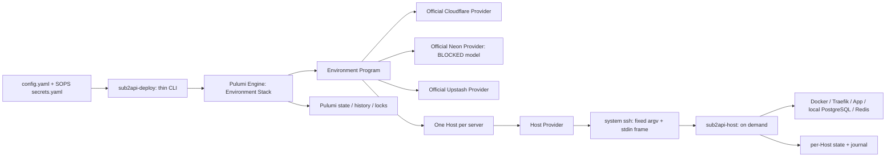

# Tech Spec: Pulumi SSH Controller

状态：`Draft for implementation review`
日期：2026-08-30
范围：001 产品本体及其 release/CLI/Program 主链；旧资源与现有生产实例迁移保留为附录，当前不纳入实施

## 1. 需求结论

本规格将 Sub2API Deploy 的产品本体定义为一个由控制机运行的 Environment Pulumi Stack：它直接管理官方 Cloudflare、Neon、Upstash resources，并为每台配置服务器注册唯一的深资源 `Host`。`Host` Provider 使用系统 OpenSSH 调用按需退出的 `sub2api-host`，由后者安全收敛该机器的 Compose/Traefik/App、本地 PostgreSQL/Redis、MicroSocks 和 tunnel connector 运行外壳。

需求 source of truth 是同目录 [context.md](./context.md)。其“目标”“设计原则”“必须定义的 Host 生命周期”“State 边界”“云资源与 Host 资源关系”和“测试原则”定义本规格的产品行为与约束；本文不得用当前代码字段自动扩展产品需求。实施拆解参考 [docs/plans/2026-08-10-pulumi-ssh-controller.md](../../plans/2026-08-10-pulumi-ssh-controller.md)，该路径存在且可读，但不取代 source of truth。用户最新决定优先于历史文档：001 当前补齐产品本体及其 release/CLI/Program 主链；旧资源与现有生产实例迁移仍保留在附录供后续单独决策；SingBox 不属于 001 目标。

- 当前范围：单阶段产品本体，包含新 release、CLI、Environment Program、Host Provider 和 `sub2api-host` 的主链闭环；不包含将现有生产实例或旧资源切换到该主链的迁移。
- Source-defined non-goals：业务数据搬运、备份/恢复、业务正确性验证、独立控制平面、第二套 desired/observed state、常驻 Agent、真实公网/云可用性/最终用户路径冒烟测试。
- 不以实现字段为需求：现有 `Target` 中的 `MicroSocks`、`Connectors`、`TunnelID` 等只证明当前合同预留，不证明其执行合同已经冻结或实现完整。
- 待产品/owner 确认的阻塞项：官方 Neon Provider package/resource schema/create outputs/`protect`/secret-unknown projection、MicroSocks/Connector 执行合同。跨 Host Docker data 的合同已由 Tasks 1-2 实现；其 Engine/runtime 证据仍待 CI。见第 11 节。

### 1.1 当前双轨、完成度与主修改路径

仓库处于明确的双轨状态，不得把其中任一轨误述为已经完成整个产品：

| 轨道 | 当前事实 | 状态 | 对 001 的含义 |
| --- | --- | --- | --- |
| 目标源码链 | 已有 `cmd/sub2api-deploy`、`cmd/sub2api-environment`、`cmd/pulumi-resource-sub2api-host`、`cmd/sub2api-host` 及对应 `internal/*` 模块。 | 已完成基础骨架，部分功能实现。 | 继续补齐并收敛为产品本体。 |
| 已发布 release 链 | `README.md`、`infra/`、Compose/Traefik/scripts 仍描述并发布“一 VPS 一 Stack、VPS 本地运行 Pulumi、`command.local.Command` 调用脚本”的 legacy 模型。 | 仍是当前 release 行为。 | 这是待补齐的产品 release gap，不阻止新主链代码、CLI、Program 与 release 的当前实施；旧实例切 writer 另属附录迁移。 |

已完成的目标源码事实包括：严格 YAML/SOPS 配置解析与 SSH alias 校验；Host contract/revision、单帧严格协议、系统 OpenSSH 固定 argv 与 artifact bootstrap；唯一 `Host` Provider schema 及主要 lifecycle（包括成功、program-first、只读 Import）；远端每 Host 状态、writer lock、journal、read-only inspect、blue/green、本地 data/proxy、preserve-data retire；以及 Environment Program 对 Host、Cloudflare、Upstash 的初步注册。当前 dirty checkout 还包含 Engine Graph、Provider Runtime、Provider Import 与 target release 的 harness/workflow；尚无当前跨 Host candidate 的 exact-SHA evidence。部分完成的事实包括：CLI 已公开受限 Pulumi 参数解析、staged stack 和 fd 3 approval 路径；Program 支持 DNS Cloudflare 与跨 Host Docker data，仍拒绝 Neon、SingBox 和 outbound proxy；runtime 明确拒绝 MicroSocks/Connectors。主要缺口是 CI-only/live nft、PostgreSQL/Redis 证据，补齐官方 Neon 模型、冻结 proxy/connector 合同，并制作/发布新的日常 release。

主修改路径按现有实施拆解收敛为：

1. `internal/environment/**` 与 `cmd/sub2api-deploy/**`：配置语义、薄 CLI、SOPS、标准 Pulumi 调用和一次性批准。
2. `internal/hostcontract/**`、`internal/hostprotocol/**`、`internal/hostprovider/**`、`internal/openssh/**`：Host 公共合同、Provider lifecycle、OpenSSH 与 protocol/state 边界。
3. `cmd/sub2api-host/**`、`internal/hostruntime/**`：按需远端执行、收敛、恢复与 preserve-data retire。
4. `internal/program/**`、`cmd/sub2api-environment/**`：Environment graph、官方 Provider、Host projection 与依赖。
5. release/CI/docs 路径：完成新 bundle、CLI/Program 接线、artifact verification 和新主链文档，是当前产品本体实施；现有生产实例的 legacy writer 停用/切换属于附录迁移。

## 2. 现有系统承接点

旧链以 `infra/main.go` 的 `deploymentProgram` 为入口，按 Host/Site 模型在目标 VPS 运行 Pulumi。`infra/commands.go` 注册 `command.local.Command`，脚本负责本机 Compose、Traefik、blue/green、host-state 和 preflight；`infra/database.go` 同时存在 alpha Neon Provider 直注册和本地 API command，`infra/cloudflare.go` 与 `infra/redis.go` 分别直接使用 Cloudflare、Upstash SDK。`README.md` 仍以这一模型、SingBox passthrough 和 VPS release bundle 为准。这些是 legacy 行为证据，不是新产品的公共接口。

目标源码已在不同模块承接多数责任：

| 复用基础 | 代码事实 | 本体中的责任 |
| --- | --- | --- |
| 环境输入 | `internal/environment/environment.go` | 严格解析、引用校验、默认值、server key 与 `sshAlias` 区分、secret scope。当前仍接受 `singBox` 字段，不能据此把 SingBox 纳入 001。 |
| 薄 CLI | `cmd/sub2api-deploy/**` | 已有 `validate`、SOPS decrypt、SSH 预检、受限 Pulumi operation parse、staged stack、TTY approval 和公开日常 `pulumi` 路径。 |
| Program | `cmd/sub2api-environment/main.go`、`internal/program/program.go` | 已从 bundle 获取 release、读取 staged config/secrets，注册每 server 一个 `Host`，并初步注册 Cloudflare/Upstash。Neon 被明确拒绝。 |
| Host 接口 | `internal/hostcontract/**`、`internal/hostprotocol/**` | 资源身份、目标 revision、data identity、approval subject、严格有界 request/response。 |
| Provider 与 transport | `internal/hostprovider/**`、`internal/openssh/**` | 一个资源 token、Create/Read/Update/Delete、artifact bootstrap、系统 `ssh` 固定 argv、host-key fail closed。 |
| 远端运行时 | `cmd/sub2api-host/**`、`internal/hostruntime/**` | 非常驻 stdin/stdout process、remote state/journal/lock、owned Docker objects、blue/green、local data/proxy、retire。当前拒绝 MicroSocks/Connectors。 |

`infra/`、`scripts/`、`compose/`、`traefik/` 和 legacy README 不得被新 Program 当作长期执行模型直接拼装调用。它们可提供行为、ownership、blue/green 和 data-preserve 的证据；目标 Host 模块必须拥有本机派生布局与执行步骤。

## 3. 技术方案

### 3.1 方案主线与完整控制链

控制机上的 `sub2api-deploy` 是薄入口：选择 Environment、解密 SOPS、执行严格预检、构造仅本次操作可见的批准通道，并调用标准 Pulumi 命令。它不保存 plan、资源图、operation ledger 或远端 journal 副本。Environment Program 把已验证的环境语义投影成官方 cloud resources 和每服务器一个 `Host` resource；Pulumi 保有 graph、preview、diff、state、protect、secret tracking、aliases、history 和 stack update lock。

每个 Host resource 的 Provider 在控制机调用系统 `ssh`。SSH 只接收一个经验证 alias，目标与 secrets 走 stdin 的有界机器 frame，远端固定入口是 `sub2api-host`。远端二进制按请求 inspect/reconcile/retire 后退出；它只保存单机 identity、ownership、applied revision、stable observation、最小 operation journal 和 retirement evidence。其本地 reconcile 操作 Docker/Traefik/runtime artifacts，产生非敏感 stable observation 供 Provider checkpoint，绝不让控制机通过 Compose names、slot、route path 或 journal phase 重新解释本机 readiness。

TR-INV-01 至 TR-INV-04 的规范性完整定义见第 10 节 Requirement Index。

### 3.2 CLI、SOPS 与批准

CLI 的公开形态必须保持窄：`validate <environment>` 负责解析、SOPS 解密与 SSH alias 预检；标准 Pulumi actions 只允许受约束的 `preview`、`up`、`refresh`、`destroy`、`import`，由 CLI 固定 stack/config/program/provider 位置。现有 `parsePulumiPlan` 已拒绝 `--stack`、`--config-file`、`--show-secrets`、remote 等可绕过项；完整命令接线应复用该限制，而非另建 plan language。

`renderStagedStack` 的职责是将 environment config、encrypted environment secrets 和 revision key 放入短生命周期的 Pulumi stack config。Program 只接受普通 `environmentConfig` 和 secret `environmentSecrets`，Host Provider 的 revision key 必须保持 secret。批准是 CLI 通过 Unix stream fd 3 传给 Provider 的一次性 admission evidence，不落入 YAML、Pulumi ordinary outputs、远端普通状态或长期开关。现有 TTY 流程展示 canonical `ApprovalSubject` 的摘要并要求精确确认；Provider 必须逐字段匹配 subject，而不能只相信用户输入文本。

### 3.3 Environment Program 与资源图

Program 的输入是已验证配置、secret 配置和 release artifact identity。它必须保留 Pulumi unknown 与 secret taint：provider 输出进入 Host 时不得提前 stringify、解密或改写成普通值。每个配置 server 以稳定 server key 注册一条 `sub2api-host:index:Host`；`sshAlias` 是 transport target，不是资源 identity。Host target 只含该机器需运行的 release、Apps、本地 data、reverse proxy 和已获批准的扩展能力；Host secrets 只投影给该机器和实际 consumer。

官方 Cloudflare、Neon、Upstash resource 必须由 Environment Program 直接注册，不增加 project-owned cloud wrapper Provider。managed data 必须 `protect=true`，适用 retention 不得替代 protect。公开入口只有依赖目标 Host readiness 成功后才注册或加入；移除时依赖反向确保先摘流量。跨 Host dependency 不用 barrier、lease、scheduler 或 transaction coordinator 表示。

当前 `internal/program` 的事实是：Cloudflare DNS 和 Upstash 已有初步 direct registration；Cloudflare 只接受 DNS 模式；managed Neon、SingBox 与 outbound proxy 仍在 preflight 显式拒绝。Tasks 1-2 已实现跨 Host Docker PostgreSQL/Redis projection、derived source admission 和 Host DAG ordering；当前 dirty checkout 有 Engine Graph/Provider Runtime harnesses and CI jobs, but no exact-SHA evidence for the current cross-Host candidate. CI-only/live nft, PostgreSQL, and Redis evidence remains pending. 产品 Neon gap 只包括官方 Provider package/resource schema、create outputs、`protect` 和 secret/unknown 投影；它不以既有 physical ID 的 import/no-replace 证据为前置条件。后者只属于附录迁移。TR-PROG-* 的规范性完整定义见第 10 节。

### 3.4 Host Provider lifecycle

Host Provider 只暴露一个深资源。它的输入面为 `resource`（Environment + stable server key）、`server`（SSH alias）、`target`（完整本机目标）和 secret `secrets`；输出面为稳定 resource ID、machine/ownership identity、applied revision 和有界 stable observation。`hostcontract.TargetRevision` 当前以 revision key 对规范化 target/secrets 计算 HMAC commitment，既让 secret rotation 驱动更新，也不要求以裸 secret/digest 作为普通 diff 输出。

| Lifecycle | 合同 | 当前源码承接 |
| --- | --- | --- |
| Check | schema、canonicalization、unknown/secret 保真；不 SSH。 | Provider shape/validation。 |
| Diff | 比较 inputs/state；普通变更 in-place；危险 data link 可见但不得写远端；不 SSH。 | Provider lifecycle logic。 |
| Create | probe machine，校验 pinned artifact，atomic install/upgrade，绑定 identity，完整 reconcile，再 inspect checkpoint。 | `lifecycleCreate` + artifact/OpenSSH bootstrap。 |
| Read | 仅 inspect，更新可信 observation/drift；unreachable、host-key、missing binary、state corrupt、identity mismatch 都保留 ID 并报错。 | `lifecycleRead` + `inspect`。 |
| Update | 先 inspect/checkpoint/approval，再以完整目标 reconcile；同 key resume 或返还原 terminal result。 | `lifecycleUpdate` + runtime journal。 |
| Delete | 仅已 drained target 可执行 approved `retire --preserve-data`。 | `lifecycleDelete`。 |
| Import | program-first、只读 state construction；证据不足失败，不靠 apply 猜测接管。 | 实现与 module/Engine tests、CI job 已在当前 dirty checkout；exact-SHA evidence 未有。 |

TR-LC-* 的规范性完整定义见第 10 节 Requirement Index；成功、program-first、只读的 Host Import 已在当前源码实现，并有 module/Engine tests 和 CI job。它仍是 evidence-pending：没有 current exact-SHA run/artifact，不能声称已通过。普通新 Environment 的 Create 不依赖 Import；迁移/cutover 另有授权，当前未执行。

### 3.5 OpenSSH、artifact 与 protocol

系统 OpenSSH 是 transport，不是可替代的 SSH client abstraction。Provider 必须直接启动 `ssh`、不启动本地 shell、不解析或复制 OpenSSH config；因此现有 `Include`、`Match`、`ProxyJump`、`ProxyCommand`、agent、certificate 和 known_hosts 语义仍由 OpenSSH 自己解释。alias 必须通过 `sshcheck.ValidateAlias` 的单 token grammar，固定 argv 使用 non-interactive、`StrictHostKeyChecking=yes`、`UpdateHostKeys=no` 等安全项，并使用经测试支持的 `--` 分隔 alias。Provider 不修改 SSH config、known_hosts 或 private keys。

远端命令面必须固定为 probe、受控 bootstrap receiver 和 `sub2api-host stdio`，禁止调用方提供 arbitrary remote command。artifact bootstrap 必须传输已验证的 pinned bytes，远端 receiver attestation 后原子替换二进制，再把原请求交给已安装 binary；禁止 `curl | sh` 或远端下载未知代码。

`hostprotocol` 当前已冻结 `s2h1:<length>\n<strict JSON>` 单帧格式、1 MiB 上限、版本、strict unknown-field/duplicate-key rejection，以及 validation/approval/transport/host-key/protocol/remote-operation/conflict/recovery-required 错误分类。stdout 只允许一个 response frame；stderr 仅作脱敏诊断且不得参与 decode；EOF、timeout、cancel、exit failure、malformed frame 与 remote error 必须被分类。编码、timeout 数值和内部 helper 数量以实现为准，除 protocol 已持久化兼容性外不额外冻结。

### 3.6 Remote state、runtime 与恢复

远端 state 不复制 Environment config。它只承载 `ResourceIdentity`、machine identity、ownership identity、applied revision、stable observation、当前/最后 journal 和 preserve-data retirement evidence。每 Host writer lock 只串行该机副作用；Pulumi stack lock 处理全局 writer。journal 的匹配键至少由 resource、action、target revision 和 prior applied revision 或 observation precondition 组成。

任何不可重复副作用遵循 `persist intent -> observe -> act if needed -> verify -> persist result`。相同匹配键重试必须 resume 或返回原 result；不同非终态操作、状态损坏或观测矛盾进入 conflict/recovery-required，不能覆盖 evidence 或 GC 掉问题。journal 不得写入 secret、DSN、dotenv、完整 Docker inspect、stdout/stderr。TR-REC-* 与 TR-STATE-* 的规范性完整定义见第 10 节。

`hostruntime` 已实现 state 文件的安全打开/原子写、single writer lock、machine identity、owned-object inventory、read-only inspect、Docker command containment、local PostgreSQL/Redis、Traefik proxy、App blue/green 和 retirement。这个事实不授权把当前内部 inventory、artifact 名称、container name、route path、slot 或 phase 变成 Program config 或 public output。

### 3.7 本机 reconcile、顺序、data link 与安全门禁

Host reconcile 接收完整目标，不按字段拼 shell effects。它先验证 machine/ownership、journal、approval、owned objects 和本机 precondition；后收敛 local data、proxy、Apps，再形成 readiness observation。App 更新在每 Host 内先准备 inactive runtime、做本机 readiness、原子写 route、经 proxy 再检查，再 drain/remove old runtime。失败必须保留或恢复旧 route/runtime，不能回滚 PostgreSQL/Redis 数据。Host-local readiness 是 runtime 安全前置条件，不是公网 smoke test。

PostgreSQL/Redis connection identity 是“连接到哪份数据”的非敏感 identity，不包括 password/token rotation。identity 改变时，Provider 在任何远端写请求前要求精确一次性批准，subject 绑定 Environment、Host resource、App、postgres/redis、old/new identity 与 target revision；恢复同一已接纳 operation 不重复消费批准，新 revision 必须重新批准。批准不授权 dump/restore、Redis copy、业务验证、schema rollback 或数据销毁。TR-DATA-* 的规范性完整定义见第 10 节。

`apps.<app>.servers: []` 是唯一 Pulumi-visible maintenance 表达，前提是该 App 已从 public access 摘除。它保留 App 定义和 data links，但从所有原 Host 完整目标中移除该 App runtime/writers、保留数据；恢复时稳定排序第一台 Host ready 后再启动其余 Host，最后恢复 public access。TR-MAINT-* 与 TR-ORDER-* 的规范性完整定义见第 10 节。跨 Host data admission is derived from placement, not user-configured firewall fields; CI still needs its full Engine/runtime evidence.

### 3.8 Secret、observation 与 release

Cloud management token 只到对应官方 Provider；provider-generated connection credential 只到消费 Host；App、local data、reverse proxy、MicroSocks、connector secrets 仅到被投影的 target Host。secrets 必须保持 Pulumi secret，绝不进入 argv、普通 output、日志、stderr、journal 正文或非目标 Host。TR-SEC-* 与 TR-OBS-* 的规范性完整定义见第 10 节：observation 必须有界、非敏感且稳定；错误分类必须脱敏；手工 runtime 改动是 drift，只修复 owned objects。

新 release 必须包含薄 CLI、Environment Program、Host Provider、`sub2api-host` 和其可验证 artifact bundle；控制机而非服务器运行 Pulumi/Provider/SOPS/cloud credentials。target release harness/workflow 已在当前 dirty checkout，仍无 exact-SHA candidate evidence，因而不能把 current source binary、测试切片或 workflow 定义表述为已发布 release。现有生产实例的 legacy writer 退出属于附录迁移，不是新 release 主链实现的前置条件。CI 才能提供构建与发布产物证据；本规格不声称 CI 已通过。

### 3.9 代表性示例：安全 App image 更新

假设 `app-a` 位于 `host-a`、`host-b`，使用同一 PostgreSQL/Redis identity，且 public access 已依赖两个 Host。操作者更新 immutable image digest 后运行受限 `sub2api-deploy pulumi production preview`。Program 保留每台 Host 的相同 stable identity，仅投影新的 `target` 与相应 secret-tainted inputs；Pulumi 以 stable server key 顺序让 `host-a` 的 Host update 成功后才允许 `host-b`，Cloudflare publication 不先于 Host readiness。

Provider 在 `host-a` 先 inspect checkpoint，生成 revision，发送一条 `reconcile` frame。远端 journal 记录 intent；runtime 启动 inactive App，执行本机 readiness，写入新 route，完成 post-route readiness，随后 drain old runtime 并持久化 applied result。若 SSH response 在 route 后丢失，下一次相同 update 用相同 operation key inspect/resume，不创建第二个 route switch；若 new runtime 不 ready，旧 route/runtime 仍保留。`host-a` stable observation ready 后，Pulumi 才继续 `host-b`；所有 Host ready 后 Cloudflare resource 才可更新。该流程不执行公网 smoke test，也不触碰业务数据。

## 4. Module / Interface / Seam Map

| Module | Interface | 隐藏的实现 | Seam | Caller / test surface | 深度与局部性 |
| --- | --- | --- | --- | --- | --- |
| `cmd/sub2api-deploy` | environment/action/approved subject | SOPS、staged stack、fd passing、Pulumi process | process/TTY/fd seam | CLI tests | 调用者只选择环境和标准动作。 |
| `internal/environment` | `Parse*`、`Validate`、validated config | YAML strictness、引用、默认值、secret scope | pure input functions | table tests | 不把 config 解析泄漏进 Program/Provider。 |
| `internal/program` | `Register(ctx, release, config, secrets)` | resource projection、provider wiring、dependency order | Pulumi mocks | Program graph tests | Program 是 graph owner，不承担 Host runtime。 |
| `internal/hostcontract` | target/revision/identity/approval values | normalization、HMAC commitment、validation | pure functions | contract tests | 唯一跨 Program/Provider/runtime 的语义 carrier。 |
| `internal/hostprotocol` | one framed request/response | framing、strict JSON、error pairing | codec boundary | codec/fuzz tests | 不暴露 transport or runtime internals。 |
| `internal/openssh` | fixed `Probe`/`Bootstrap`/`Run` | argv、process lifecycle、host-key classification | processStart test seam | recording process + loopback | 不建 generic SSH adapter；系统 OpenSSH 是唯一 production transport。 |
| `internal/hostprovider` | Pulumi `Host` lifecycle | checkpoint, artifact install, approval admission | lifecycle transport/artifact/approval dependencies | provider harness | 将 Pulumi lifecycle 复杂度集中在一个 deep module。 |
| `cmd/sub2api-host` + `internal/hostruntime` | stdio request -> result | remote state, journal, Docker/route artifacts | command runner | temp runtime/recording command tests | 单机副作用只在此处拥有；不泄漏 layout。 |

没有真实变化轴时不得为测试新增空 interface 或通用 manager。现有 process runner、lifecycle dependency 和 runtime command runner 已是针对 transport/artifact/approval/runtime 的真实 seam；测试应通过这些 interface 证明行为，不要求调用方了解内部 state 文件。

## 5. 目录组织与变更地图

| 范围 | 动作 | 路径 | 目标能力 | 说明 |
| --- | --- | --- | --- | --- |
| 环境配置 | 重构/补齐 | `internal/environment/**` | 完整产品语义和严格 validation | 保持 server key 与 SSH alias 分离；SingBox 不作为 001 支持面。 |
| CLI | 补齐 | `cmd/sub2api-deploy/**` | validate、标准 Pulumi wrapper、SOPS、approval fd | 不保存 plan/ledger，不扩展自定义 action language。 |
| Environment Program | 补齐 | `cmd/sub2api-environment/**`, `internal/program/**` | 官方 Providers、每 server 一个 Host、graph/order | Neon blocker and cross-Host CI evidence gap must remain explicit. |
| Host contract/protocol | 复用/收敛 | `internal/hostcontract/**`, `internal/hostprotocol/**` | target、revision、approval、framing | 公共语义最小化；具体字段仍由代码 skeleton 定稿。 |
| Host Provider | 补齐 | `cmd/pulumi-resource-sub2api-host/**`, `internal/hostprovider/**`, `internal/hostresource/**` | 唯一 custom resource lifecycle | 保持 Check/Diff pure、Read/Import read-only。 |
| SSH/artifact | 复用/补齐 | `internal/openssh/**`, `internal/sshcheck/**`, `internal/artifact/**` | system OpenSSH、pinned install | 不改 SSH config/known_hosts/private keys。 |
| Remote Host | 补齐 | `cmd/sub2api-host/**`, `internal/hostruntime/**` | inspect/reconcile/recovery/retire | 仅每 Host remote state；无常驻 service。 |
| 新 release 主链 | 新增/替换 | release scripts, CI, README | 新 bundle、CLI/Program 接线与用户入口 | 当前产品本体实施；当前 release 仍为 legacy 只是待补齐 gap。 |
| Legacy 证据与旧实例 | 只读参考，后续迁移 | `infra/**`, `scripts/**`, `compose/**`, `traefik/**` | 行为对照、旧资源/实例迁移输入 | 不把 legacy command chain 直接搬进新 Program；旧 writer 退出只在迁移授权后处理。 |

概念落地：`Host`、resource/server/machine/ownership identity、target revision、approval subject、stable observation 和 remote journal 是持久或跨进程合同概念。`Compose project`、container/network name、route path、slot、artifact file、journal phase、runtime layout 是 Host implementation detail，不落成用户配置、全局 resource 或稳定 output。

## 6. Code-design 结论

- Gate：`heavy/design-orchestration`。001 新增并连接了长期存在的 resource boundary、跨进程 protocol/state、remote runtime、secret/approval 与 release architecture；错误形态会造成持续复杂度或数据风险。
- 最小设计形态：仅四个项目运行实体，`sub2api-deploy`、Environment Program、唯一 Host Provider、按需 `sub2api-host`；Pulumi 与官方 Providers 保持平台职责。Host 是唯一 custom deep resource。
- 现有承载检查：当前目标源码已提供 Host contract、protocol、OpenSSH、provider、runtime 和 Program 的自然 carrier；因此不新增 controller service、agent daemon、resource graph、operation DB、cloud wrapper、lease、transaction coordinator、generic SSH abstraction 或 adapter layer。
- 关键拒绝替代：拒绝将 App、Traefik、PostgreSQL、Redis、MicroSocks、connector、slot、route 拆成自定义 Pulumi resources；拒绝 control ledger/saved-plan engine；拒绝因测试制造 production-only empty interfaces；拒绝把 legacy Shell/TypeScript 直接作为新 control chain。
- 开放风险：Neon、MicroSocks/Connector 尚未能以现有实现或 source 自动推导，必须先作 owner decision，不能用更大抽象掩盖缺口。跨 Host data requires CI evidence, not a new product decision.

## 7. 可检查约束

| 类型 | 约束 |
| --- | --- |
| MUST | 使用一个 Environment Stack、官方 Cloudflare/Neon/Upstash Providers 与每 server 一个 `Host`。 |
| MUST | 保持 Pulumi unknown/secret/protect/dependency 语义，并由 Host success 作为 downstream readiness gate。 |
| MUST | 使用系统 OpenSSH 的固定 argv、host-key fail closed、stdin request 和 stdout 单帧 response。 |
| MUST | 在 Create 安装并 reconcile；Read/Import 只读；Read error 保留 resource ID；Delete preserve data。 |
| MUST | 以 resource/action/revision/prior condition journal key 恢复 unknown result，禁止盲目重做副作用。 |
| MUST | 对 data identity change 与 Host retire 使用精确一次性 approval，写副作用前核对。 |
| SHOULD | 复用当前 `hostcontract`、`hostprotocol`、OpenSSH process seam 和 runtime command seam，保持责任局部。 |
| SHOULD | 将 release compatibility、跨 Host dependency 和 publication 前置条件表达为 Program/Host 合同，而非 CLI workflow。 |
| MUST NOT | 创建第二套 plan/state/graph、常驻 Agent、cloud reconciler、control ledger、approval PKI 或事务协调器。 |
| MUST NOT | 泄漏 secret 到 argv、普通 output、日志、stderr、journal 或非目标 Host。 |
| MUST NOT | 将 SingBox 作为 001 目标，或因为 config 字段/legacy Traefik 文件存在而实现它。 |
| MUST NOT | 将未冻结的 Neon、MicroSocks/Connector 细节伪造为既定合同，或把跨 Host data 的 implementation-present 状态夸大为 CI-proven。 |

## 8. 验证边界与验收

详细矩阵见 [test-spec.md](./test-spec.md)。测试采用分层闭环加核心 offline chain：配置/contract/protocol 的纯测试、Provider/OpenSSH process seam、Host runtime command seam 与 Program graph/engine rehearsal 分别证明所属责任；核心 offline chain 只连接必要公共边界，不要求单体端到端链。test-only adapter 必须复用现有 process/lifecycle/runtime seams，不增加 production API。第 10 节定义 AC-01 至 AC-12；它们是实现/发布后的验收标准，当前不代表通过。

| 验收 ID | 当前含义 | 当前状态 |
| --- | --- | --- |
| AC-01 | Program graph、官方 Provider、Host count、dependency/protect/secret/unknown。 | 部分：Cloudflare/Upstash/Host 有源码，Neon 与完整依赖未完成。 |
| AC-02 | 完整 Host lifecycle，Create install+reconcile，Read/Import read-only。 | implementation-present/evidence-pending：成功 Import、tests 和 CI job 已在当前 dirty checkout；无 exact-SHA evidence。 |
| AC-03 | OpenSSH 与 protocol 安全。 | 部分：源码/测试存在，未声称 CI/release evidence。 |
| AC-04 | unknown-result 单副作用恢复。 | 部分：journal/runtime 代码存在。 |
| AC-05 | blue/green 与跨 Host failure stop。 | 部分：本机 blue/green、cross-Host ordering/admission implementation 存在；Engine/runtime CI evidence 未闭合。 |
| AC-06 | data-link approval 零副作用 guard。 | 部分：contract/provider/runtime 有实现。 |
| AC-07 | preserve-data Delete。 | 部分：实现切片存在。 |
| AC-08 | identity-preserving migration rehearsal。 | 不在当前产品本体实施，移至附录。 |
| AC-09 | Pulumi property semantics engine evidence。 | 部分：Program mocks 存在，完整 provider matrix 未完成。 |
| AC-10 | P0 无 skip 后才可进入下一阶段评审。 | 未达成，不声称测试已通过。 |
| AC-11 | 不使用公网/云/最终用户 smoke test；readiness 仅本机。 | 固定边界。 |
| AC-12 | binary/bundle 构建证据仅来自 CI。 | 固定边界；当前无 CI 通过声明。 |

验证必须覆盖 `TS-P0-*` 的 Program、lifecycle、SSH/protocol、recovery、blue/green、order、maintenance、data approval、Delete、secret 分层；migration P0/P1 只在后续迁移授权时启用。Engine Graph、Provider Runtime、Provider Import 和 target release harness/workflow 已在当前 dirty checkout；本轮文档工作没有运行构建、测试、vet、Docker、SSH、Pulumi、release 或动态验证。本文代码事实来自本轮可读工作树，不主张具有当前 exact-SHA 的动态执行证据。

## 10. 规范性 Requirement Index

本索引是 001 的规范性需求定义，不以当前实现状态替代需求。每项的产品 authority 均为 [context.md](./context.md)；表中 `§` 一律指 `context.md` 的主要章节，而非本文编号。`TR-MIG-*`、`TR-MIG-CLOUD-*`、`TR-ROLLBACK-*` 仅在附录迁移授权后实施。

| ID | 完整规范性语义 | Context 锚点 |
| --- | --- | --- |
| TR-INV-01 | Pulumi 是唯一全局 lifecycle、dependency、preview 和 state engine。 | §3.2 |
| TR-INV-02 | 一个 Environment 只有一个 Stack，且每台 server 恰有一个 Host resource。 | §1、§3.2、§8 |
| TR-INV-03 | Host 是唯一 custom resource，并隐藏全部本机 layout 和 execution detail。 | §3.1、§3.3 |
| TR-INV-04 | `sub2api-host` 不常驻；控制机离线不得改变服务器运行状态。 | §3.5 |
| TR-INV-05 | Check 与 Diff 不产生 SSH 或其他外部副作用。 | §6、§10 |
| TR-INV-06 | Read 与 Import 只读；unreachable 或 corrupt 不得解释为 resource absent。 | §6、§9、§10 |
| TR-INV-07 | 相同 Host、action、target revision 和 prior observation 的 retry 不重复非幂等副作用。 | §3.7、§6、§10 |
| TR-INV-08 | Host Update 与 Delete 不得隐式销毁或重新初始化 persistent data。 | §3.9、§6 |
| TR-INV-09 | PostgreSQL/Redis data identity 未获匹配 approval 时，远端写副作用为零。 | §3.8、§6 |
| TR-INV-10 | 迁移期间同一 Host 或 cloud physical resource 至多一个 writer。 | §9 |
| TR-SEC-01 | official Provider output 投影到 Host input 时保留 Pulumi unknown 与 secret 标记。 | §8 |
| TR-SEC-02 | Program 不得为 Host payload 提前 stringify、解密 unknown 或将 secret 降级为普通值。 | §8 |
| TR-SEC-03 | 相关 secret rotation 必须更新 consumer Host，但 revision/diff 不得成为明文或可离线猜测 secret 的 digest oracle。 | §8 |
| TR-SEC-04 | secret 不得进入 argv、日志、ordinary output、stderr 诊断、journal 正文或非目标 Host。 | §3.6、§8 |
| TR-SEC-05 | Pulumi state 只以 secret tracking 保存必要 secret input；远端生成文件只是 runtime artifact。 | §7、§8 |
| TR-PROG-01 | 一个 Environment 注册一个 Stack 范围，且每个 configured server 恰注册一个 Host。 | §1、§8 |
| TR-PROG-02 | Cloudflare、Neon、Upstash 必须经各自 official Provider 直接注册，不增加 project-owned cloud wrapper Provider。 | §1、§8 |
| TR-PROG-03 | managed Neon/Upstash data resource 必须 `protect`；retention 不能替代 protect。 | §3.9、§8 |
| TR-PROG-04 | managed resource create output 或后续 adoption 的 endpoint/credential 只投影到 consumer；external service 仅投影已验证 connection，不注册伪 cloud resource。 | §8 |
| TR-PROG-05 | public Cloudflare resource 只能在 target Host readiness 成功后创建/加入；删除顺序先摘流量再处理 Host。 | §8 |
| TR-PROG-06 | 跨 Host local data 时，data Host allow-source/readiness 在 App Host 前，App Host 在 public entry 前。 | §8 |
| TR-PROG-07 | 跨 Host/cloud 顺序通过 Pulumi dependency 表达，不创建 barrier、scheduler、lease 或 transaction coordinator。 | §3.2、§8 |
| TR-PROG-08 | Stack update 可部分成功并由 Pulumi 保存；不承诺 cross-Provider/cross-Host 原子性。 | §3.2 |
| TR-HOST-01 | Host identity 由 Environment 与 stable server key 决定；key 不得作为普通 Update 或 Diff 自动 replacement。 | §3.3、§6 |
| TR-HOST-02 | 第一次写副作用前验证 machine identity；之后 Read/Update/Delete/Import 必须匹配。 | §6 |
| TR-HOST-03 | 同机 server-key rename 仅经显式 alias/state move，后续操作重新验证 machine；不得 delete/create 模拟。 | §6 |
| TR-HOST-04 | alias/OpenSSH config 改变但仍指向同机可 in-place；machine mismatch fail closed，不自动 replacement/adoption。 | §3.6、§6 |
| TR-HOST-05 | 物理替换使用新 key/new Host/staged graph，先建新 Host/dependency，再摘流量/退役旧 Host。 | §6、§8 |
| TR-HOST-06 | transient health、timestamp、container ID、restart count、latency 不进入 desired revision。 | §3.3 |
| TR-LC-CHECK-01 | Check 只做 schema decode、known-value validation、default、canonicalization、identity-shape validation。 | §6 |
| TR-LC-CHECK-02 | Check 保留 unknown/secret property；不得把 unknown 当空值或造伪 revision。 | §6 |
| TR-LC-CHECK-03 | Check 不 SSH、不读 remote file、不调 cloud API。 | §6 |
| TR-LC-DIFF-01 | Diff 只比较 Pulumi input 与 prior state，不 SSH。 | §6 |
| TR-LC-DIFF-02 | image/release/config/secret rotation 是 in-place Update，不默认 replacement。 | §6 |
| TR-LC-DIFF-03 | PostgreSQL/Redis connection identity、server identity、persistent data identity 与 local data removal 必须显著显示。 | §3.8、§6 |
| TR-LC-DIFF-04 | danger link 可显示 Update diff，但无匹配 approval 的 Update 必须在任一 remote write 前失败。 | §3.8、§6 |
| TR-LC-DIFF-05 | stable server-key 改变不接受为 ordinary Update/automatic replacement；同机 rename 用 alias/state move，物理替换用 staged new/old Hosts。 | §6 |
| TR-LC-CREATE-01 | Create 从安全 OpenSSH 与所需 OS privilege 开始，完整拥有 install+reconcile，不要求日常 pre-bootstrap lifecycle。 | §6 |
| TR-LC-CREATE-02 | Provider 只传输 bundle-pinned、verified artifact；禁止 `curl | sh` 或 remote unknown download。 | §6 |
| TR-LC-CREATE-03 | 同 artifact install 幂等；install 后同次 Create 继续完整 reconcile。 | §6 |
| TR-LC-CREATE-04 | existing runtime 的 ownership/identity 不可证明时停止，要求 explicit migration/adoption，不猜测接管。 | §6、§9 |
| TR-LC-READ-01 | Read 只 `inspect` stable observation/readiness/drift，不 install/recover/reconcile/start Docker。 | §6 |
| TR-LC-READ-02 | healthy、drifted、pending operation 都保留 resource ID。 | §6 |
| TR-LC-READ-03 | unreachable、timeout、host-key failure、protocol error、missing binary、remote state missing/corrupt、identity mismatch 均保留 ID 并报错，不得 NotFound。 | §6、§10 |
| TR-LC-READ-04 | error 或 partial response 不得覆盖上一个可信 Pulumi checkpoint。 | §6 |
| TR-LC-READ-05 | 仅 matching resource+machine、格式合法且由 managed preserve-data Delete 写入的 retirement evidence 才可 ended；其他情况保留 ID 并报错。 | §3.9、§6 |
| TR-LC-UPDATE-01 | Update 发送完整 Host target，由 `sub2api-host` reconcile，不按字段拼 shell effect。 | §3.3、§6 |
| TR-LC-UPDATE-02 | Update 写副作用前校验 machine/ownership、prior revision、pending operation 与 danger approval。 | §3.7、§3.8、§6 |
| TR-LC-UPDATE-03 | 同 operation key resume/返回 terminal result；不同 non-terminal operation fail closed。 | §3.7 |
| TR-LC-UPDATE-04 | journal 损坏、result 未知或 observation 矛盾进入 recovery-required，不以新 operation 覆盖 evidence。 | §3.7 |
| TR-LC-UPDATE-05 | Update 不隐式删除/替换/重初始化 volume/data path；App removal 只清 owned shell，保留 data。 | §3.9 |
| TR-LC-DELETE-01 | Delete 是 `retire --preserve-data`，只解除 deploy-owned runtime shell。 | §3.9 |
| TR-LC-DELETE-02 | Delete 保留 volumes、bind/data paths、PostgreSQL/Redis 内容、manual/unowned objects 和 recovery evidence。 | §3.9 |
| TR-LC-DELETE-03 | 仍被 App、public access、proxy 或 data link 引用的 server 不得 Delete。 | §8 |
| TR-LC-DELETE-04 | Host 先摘 public entry/consumer relation，再经精确 one-shot approval Delete。 | §3.8、§8 |
| TR-LC-DELETE-05 | ordinary Delete 无 data-destruction variant；data destruction 是独立授权流程。 | §3.9 |
| TR-LC-IMPORT-01 | Import program-first：Program 先注册完整 Host input，再以 stable identity import。 | §6 |
| TR-LC-IMPORT-02 | Import 只 inspect/state construction，不 install、reconcile、ownership write、render 或启停 runtime。 | §6 |
| TR-LC-IMPORT-03 | missing binary 或无法证明 machine/ownership/active runtime/persistent path/data identity 时 Import 失败。 | §6 |
| TR-LC-IMPORT-04 | migration 可先部署只读 inspect；它不是 Import，也不是 ordinary Create 前置条件。 | §6、§9 |
| TR-LC-IMPORT-05 | Import 后 preview 必须 no-op 或仅 explicit accepted non-dangerous in-place diff；不得 apply 猜测接管。 | §6 |
| TR-SSH-01 | Provider 直接启动系统 `ssh`，不经 local shell。 | §3.6 |
| TR-SSH-02 | alias 为受限单个 OpenSSH Host token；拒绝 option、control/space、shell metacharacter、`user@host`、`host:port`、URI 与 multi-destination 绕过形式。 | §3.6 |
| TR-SSH-03 | host-key verification fail closed；Provider 无 bypass，且不改 SSH config、known_hosts、private key。 | §3.6 |
| TR-SSH-04 | remote entrypoint 固定、不可 arbitrary command；target/secret 走 stdin，不进 argv。 | §3.6 |
| TR-SSH-05 | 操作 non-interactive；timeout/cancel/failure 后回收 local `ssh` 及 child process。 | §3.6 |
| TR-SSH-06 | 使用经目标 OpenSSH 验证的 `--` 或等价 fixed argv；alias validation 仍必需。 | §3.6 |
| TR-SSH-07 | Provider 不解析/复制 `HostName`、`User`、key、Include、Match、jump/command、agent、certificate、known_hosts 语义。 | §3.6 |
| TR-PROTO-01 | stdin request/stdout response 是 versioned、bounded、machine-parseable frame。 | §3.6 |
| TR-PROTO-02 | stdout 仅一完整 frame；empty/truncated/double/polluted/oversize/incompatible frame fail closed。 | §3.6 |
| TR-PROTO-03 | stderr 仅 redacted diagnostic，不参与 response decode。 | §3.6 |
| TR-PROTO-04 | exit status、transport loss、timeout/cancel、malformed frame、remote app error 可区分。 | §3.6 |
| TR-PROTO-05 | response loss 不代表无 remote effect；Provider 不自动开始第二个 non-idempotent operation。 | §3.6、§3.7 |
| TR-REC-01 | 每 Host 至多一个 local writer，write operation 用同一 exclusive lock。 | §3.7 |
| TR-REC-02 | operation key 至少含 Host identity、action、target revision、started-at applied revision 或 stable-observation precondition。 | §3.7 |
| TR-REC-03 | non-repeatable effect 遵循 persist intent、observe、act-if-needed、verify、persist result。 | §3.7 |
| TR-REC-04 | 同 key retry resume/return original terminal result，不创第二 operation。 | §3.7 |
| TR-REC-05 | different revision/non-terminal conflict 停止；corrupt/contradictory evidence 在人工恢复前不得 GC。 | §3.7 |
| TR-REC-06 | journal 不存 secret、DSN、dotenv、完整 stdout/stderr、Docker inspect 原文。 | §3.7 |
| TR-DATA-01 | approval 是当前 operation admission evidence，不是 YAML long-lived switch。 | §3.8 |
| TR-DATA-02 | Provider remote write 前精确核对 approval；不得跨 Host/identity/revision 使用。 | §3.8 |
| TR-DATA-03 | SSH unknown resume 同一 admitted operation 不重复消费 approval；new operation/revision 需要新 approval。 | §3.8 |
| TR-DATA-04 | approval 不证明 migration，不授权 dump/restore、Redis copy、business validation、schema rollback。 | §3.4、§3.8 |
| TR-MAINT-01 | `servers: []` 保留 App/data link，停止原 Host owned runtime/writer、preserve data，且 public access 必须为空。 | §8 |
| TR-MAINT-02 | 恢复 placement 仅 stable first Host 先启动；其 ready 后启动其余，再 publication。 | §8 |
| TR-MAINT-03 | incompatible image 用 public-off/empty-placement/first/remaining/public-on，不伪造 data identity/approval，不增 maintenance resource/transaction。 | §8 |
| TR-ORDER-01 | cross-Host dependency 从 Environment relation/stable key 派生，并在 registration 前检测环。 | §8 |
| TR-ORDER-02 | 新 compute 访问 local data：allow-source、App readiness、public publication 的顺序。 | §8 |
| TR-ORDER-03 | 移除 compute：detach publication、stop App/connector、remove data-host source 的顺序。 | §8 |
| TR-ORDER-04 | first bootstrap 由 stable first Host 单副本完成，ready 后其余启动；leader 非持久角色/resource。 | §8 |
| TR-ORDER-05 | 同 App image multi-Host 按 stable order serial update；失败后续不执行。 | §8 |
| TR-ORDER-06 | Host-local blue/green：start inactive、local readiness、atomic route switch、confirm、drain/stop old。 | §3.7、§8 |
| TR-ORDER-07 | new runtime/route probe failure 恢复旧 route/active runtime、清理失败 owned runtime；不 rollback data。 | §3.4、§3.7 |
| TR-STATE-01 | CLI/Provider 不存 Pulumi graph、plan 或 global operation ledger mirror。 | §3.2、§7 |
| TR-STATE-02 | remote Host state 不是 Environment config 副本，不存其他 Host desired state/cloud graph。 | §7 |
| TR-STATE-03 | 仅改有明确 deploy ownership evidence 的对象；同名 unowned object fail closed。 | §3.9 |
| TR-STATE-04 | Pulumi Stack lock 处理 global writer；per-Host lock 只处理单机副作用，不升级为 environment lease。 | §3.2、§3.7 |
| TR-RETIRE-01 | retirement approval 只确认 operation scope/preserve-data，不授权 data destruction。 | §3.8、§3.9 |
| TR-RETIRE-02 | retirement 任一步失败由 Pulumi checkpoint 表示，以后续 normal update 继续；不建 transaction/ledger/successor engine。 | §3.2 |
| TR-OBS-01 | Host output 仅 stable、non-sensitive、bounded observation；详细 stderr/inspect diagnostic 非稳定 API。 | §3.3 |
| TR-OBS-02 | error 区分 validation、approval、transport、host-key、protocol、remote operation、conflict、recovery-required，且 redacted。 | §3.6 |
| TR-OBS-03 | controller/remote log 不记录 secret；测试用 canary 扫描边界。 | §3.6、§8 |
| TR-OBS-04 | manual generated-runtime edit 是 drift；Read observe，Update 只修 owned object。 | §3.9 |
| TR-OBS-05 | controller cancel 不遗留 local SSH/ProxyCommand child；remote result 仍按 unknown-result 合同恢复。 | §3.6、§3.7 |
| TR-MIG-01 | 迁移时同一 Host 同刻仅 old 或 new writer；两 Stack lock 不足证明。 | §9 |
| TR-MIG-02 | old entrypoint 无 shared guard 时必须完全停用 old writer，不能用 manifest/registry 替代。 | §9 |
| TR-MIG-CLOUD-01 | 旧 Cloudflare/Neon/Upstash physical resource 迁移目标 preview 为 0 create/0 delete/0 replace。 | §9 |
| TR-MIG-CLOUD-02 | 同 provider type 优先 state move/alias 与完整 provider-parent-dependency closure，保留 physical ID/continuity 并记录 URN mapping。 | §9 |
| TR-MIG-CLOUD-03 | provider type/schema 变化时 program-first import，先 freeze source writer/protect physical resource。 | §9 |
| TR-MIG-CLOUD-04 | 验证 target URN/provider closure/physical ID/continuity/protect/retention/secret taint 后才移除 source state，不 Delete。 | §9 |
| TR-MIG-CLOUD-05 | official Provider 不能无损 import、强制 replace 或 identity 不可证明时 migration blocked。 | §9 |
| TR-ROLLBACK-01 | 新 Host Import 后、首个新 write 前，可在 lock 中确认 observation 未变后撤 ownership/恢复 old writer。 | §9 |
| TR-ROLLBACK-02 | 新 Provider 已写时，先用同一 remote journal 收敛明确 observation，不能盲启 old writer。 | §9 |
| TR-ROLLBACK-03 | cloud state migration interrupted 时两侧停 apply、对账 backend state/physical ID 后继续，不双写修复。 | §9 |

| AC ID | 完整验收语义 | Context 锚点 |
| --- | --- | --- |
| AC-01 | Program graph 满足 TR-PROG-01..08，并覆盖 `TS-P0-PROG-*`。 | §8、§10 |
| AC-02 | Host lifecycle 满足 TR-LC-*；Create install+reconcile，Read/Import read-only。 | §6 |
| AC-03 | OpenSSH/protocol 满足 TR-SSH-*、TR-PROTO-*，有 loopback 与 recording transport evidence。 | §3.6、§10 |
| AC-04 | same-operation unknown-result retry 不重复副作用，满足 TR-REC-*。 | §3.7 |
| AC-05 | blue/green failure 保留旧 route/runtime，cross-Host failure 停止后续 update。 | §8 |
| AC-06 | dangerous data-link 无 approval 零 remote write；有 approval 仅匹配 operation。 | §3.8 |
| AC-07 | Delete preserve data/unowned object，并支持 response-loss same-operation resume。 | §3.9 |
| AC-08 | 后续迁移 rehearsal 证明 identity continuity、cloud preview 0/0/0、single-writer。 | §9 |
| AC-09 | Pulumi secret/unknown/dependency/protect 有 engine-level evidence。 | §8、§10 |
| AC-10 | `test-spec.md` P0 无 skip 后才可提出下一 implementation/migration review；spec status 不自动改变。 | §10 |
| AC-11 | 验收不跑 real public endpoint/cloud availability/end-user smoke；Host-local readiness 只证明 reconcile 前置条件。 | §10 |
| AC-12 | binary/frontend bundle/release artifact build evidence 来自 CI；本地验收不得 build。 | §10 |

## 11. 风险与待决策

| 风险或问题 | Owner | 需要在何时决定 | 当前处理 |
| --- | --- | --- | --- |
| 官方 Neon Provider package、resource schema、create output、`protect` 与 secret/unknown projection | 产品/infra owner | Program Neon create 实现前 | BLOCKED；这是当前产品 Neon create 能力的 blocker。旧 physical ID/import/no-replace 不属于本项，见附录迁移。 |
| 旧 Neon physical ID 的 official Provider import/no-replace 迁移证据 | migration owner | 后续迁移授权后 | BLOCKED；不阻止当前官方 Provider Neon create 能力。 |
| 跨 Host PostgreSQL/Redis allowlist 的 Engine graph 与 privileged runtime evidence | Program/infra owner | production readiness 前 | implementation-present/evidence-pending + Task4 harness gap；Tasks 1-2 derive source admission, ordering, and runtime policy. Existing current-checkout harness/jobs do not provide exact-SHA evidence for this cross-Host candidate; CI-only/live nft, PostgreSQL, and Redis evidence remains pending. |
| MicroSocks/Connector 的运行形态、ownership、credential scope、network/allowlist、retire/rollback 合同 | 产品/infra owner | 实现 runtime support 前 | BLOCKED；contract fields 存在但 runtime 显式拒绝，不能以字段存在视为需求完成。 |
| 新 release 主链尚未交付 | release owner | 产品本体 release 实施时 | 当前 legacy release 是现状与待补齐 gap，不阻止新主链实现；不得因此声称新 release 已发布。 |
| 现有生产实例的 legacy writer 与新链 writer 的切换 | migration owner | 后续迁移授权后 | 单独证明 single-writer；不作为当前产品 release/CLI/Program 主链实施的前置条件。 |
| Host machine identity 的宿主证据适用于实际 SSH 用户/替换场景 | infra owner | production readiness 前 | 当前使用 HMAC machine-id evidence；生产适用性仍需确认。 |
| artifact install 所需最小权限 | infra owner | Create release 前 | 当前 bootstrap 固定 `sudo -n` receiver；允许的生产权限集合需验证。 |

## 附录 A：迁移约束（保留，当前不实施）

本附录保留 `context.md` 第 9 节和旧版 TR-MIG-*/TR-ROLLBACK-* 的安全意图，供后续单独获得产品授权的旧资源与现有生产实例迁移规格使用。它不是 001 当前产品本体 implementation scope，不能作为“实现后自动切换 legacy writer”的依据，也不阻止当前 release/CLI/Program 主链实施。

实施拆解参考中的 Task 10（single-writer、adoption、state/cutover）已被用户当前决定 supersede 为附录迁移工作。Task 11 中的新 CLI、`Pulumi.yaml`、Environment Program、release、CI 与 docs 属于当前产品本体主链；其中针对现有实例的 old writer 退出、state cutover 与生产迁移验证移入本附录。该 supersede 只重划实施范围，不改变 Requirement Index 中迁移 ID 的后续约束。

后续迁移至少需要：脱敏 inventory（URN/provider ID/protect/retain、machine/ownership、Compose/runtime/data identity、active route/image、legacy mutation entrypoints）；先只读 inspect；每 Host single-writer guard 或完整停用旧 writer；program-first Host import；cloud resources 的 physical identity continuity 和 `0 create, 0 delete, 0 replace` rehearsal；以及新 Host write 前后不同的回退边界。无法证明官方 Provider import、identity 或 writer exclusivity 时必须 `BLOCKED`，不得用 legacy bridge、effect registry 或控制机 ledger 补偿。

TR-MIG-01..02、TR-MIG-CLOUD-01..05、TR-ROLLBACK-01..03 和 AC-08 仍保留为稳定追踪 ID，但其实施、测试和 production cutover 需要后续明确授权；本规格不把迁移要求削弱为产品本体的延后实现，也不将其纳入当前 release acceptance。

## 附录 B：明确未冻结项

- 产品 Neon：official Provider package、resource schema、create output、`protect` 与 secret/unknown projection。
- 迁移 Neon：既有 physical ID 的 import/state-move recipe 与 no-replace 无损映射证据。
- cross-host allowlist 的 CI Engine/runtime evidence（合同已实现，不是 owner-decision blocker）。
- MicroSocks/Connector 的执行合同。
- machine identity 最终生产证据、artifact privilege contract。
- protocol 已冻结格式之外的 timeout、具体 package helper、journal schema/phase/retention、runtime directory/Compose/container/network/slot/route 命名。
- stable ordering key 的最终实现细节、release compatibility metadata、Cloudflare DNS/load-balancer/tunnel resource 对 readiness 的准确映射。

这些未冻结项不得被实现自动升级为产品需求；其中前三项对应第 11 节的阻塞设计决策，其余项目可在不违反本规格不变量的 skeleton/implementation 阶段收敛。
