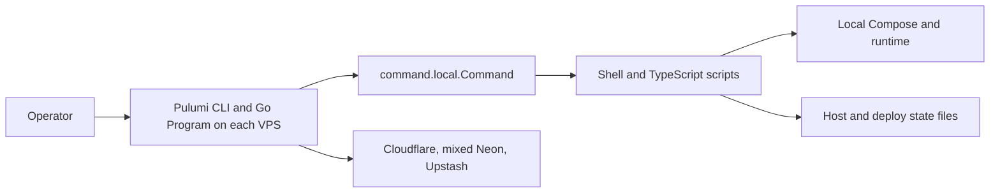
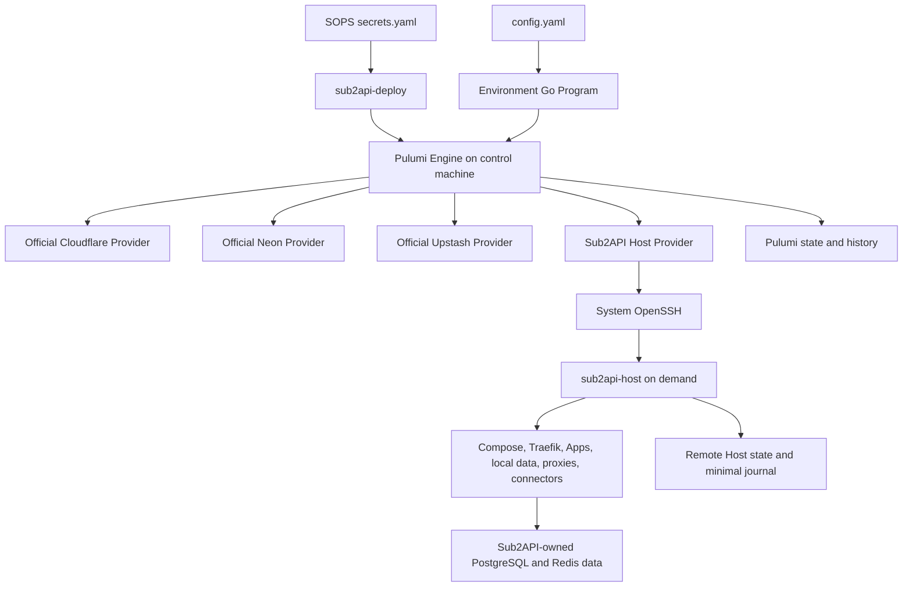
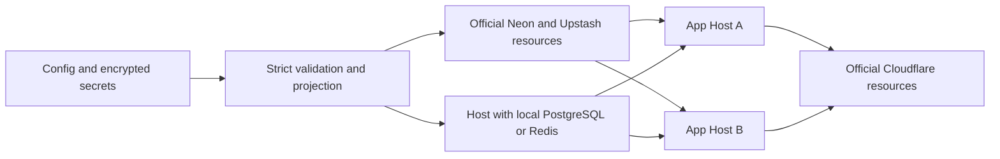

# Pulumi SSH Controller 一般技术规格

状态：`Draft for implementation review`

日期：2026-08-10

## 1. 文档定位

本文定义 Sub2API Deploy 从每服务器本地 Pulumi 部署迁移到单 Environment Pulumi Stack 的一般技术合同，固定责任边界、资源关系、Host 生命周期、安全语义、故障恢复、迁移约束和验收方向，供后续实现评审使用。

本文不是实现冻结、完成声明或生产切换授权。
详细验证场景见同目录的 [test-spec.md](./test-spec.md)。

需求唯一权威来源是 [context.md](./context.md)；`plan.md` 与 `_working/` 下文档仅为综合输入。已弃用远端分支仅可参考目录与一般 spec 形式，不构成设计依据。

## 2. 目标

- 一个 Environment 对应一个 Pulumi Stack。
- Environment Program 直接注册官方 Cloudflare、Neon、Upstash Provider 资源。
- 每台配置服务器对应一个且唯一一个自定义 `Host` resource。
- 自定义 Provider 只暴露 `Host`，并将每台机器的完整安装、检查、收敛、恢复和安全退役隐藏在该深模块内。
- Host Provider 在控制机上直接调用系统 OpenSSH。
- 远端 `sub2api-host` 仅按请求执行，完成后退出。
- Pulumi 唯一拥有全局 graph、state、preview、diff、依赖顺序、update lock 和 lifecycle。
- 控制机离线后，已运行的 Compose、Traefik、App、数据服务、代理和 connector 不受影响。
- 在不搬运业务数据的前提下，为数据链接变化、滚动、退役和迁移提供 fail-closed 行为。
- 用最少概念形成可实施合同，并保留实现选择空间。

## 3. 非目标

- 不管理 PostgreSQL 或 Redis 的备份、复制、恢复、校验和业务数据迁移。
- 不替代 Sub2API 自身在应用启动时触发的 schema migration。
- 不建立独立 plan engine、resource graph、operation database 或 cloud reconciler。
- 不建立 control ledger、environment lease、saved-plan successor engine 或分布式事务协调器。
- 不建立长期 desired/observed state 镜像或远端 journal 的控制机数据库。
- 不提供常驻 Agent、监听端口、注册、心跳、服务发现或持续 reconcile loop。
- 不包装官方云 Provider，也不让 `sub2api-host` 调用云 API。
- 不把 App、Traefik、PostgreSQL、Redis、MicroSocks、Tunnel connector、slot 或 route 建成自定义 Pulumi resources。
- 不提供普通 Delete 的数据销毁模式。
- 不在第一版引入独立 Ed25519 approval PKI、Host clock、签发者体系或通用审批平台。
- 不冻结内部 phase 数量、journal 保留期限、容量、目录权限矩阵或 package 布局。
- 不执行真实公网 endpoint、云服务可用性或最终用户路径冒烟测试，也不把它们作为部署后验收或完成门槛。
- 不在开发机本地构建binary、前端bundle或release产物；所有构建和发布产物验证只在CI环境执行。

## 4. 核心不变量

| ID | 不变量 |
| --- | --- |
| TR-INV-01 | Pulumi 是唯一全局生命周期、依赖、preview 和 state 引擎。 |
| TR-INV-02 | 每个 Environment 只有一个 Stack，每台服务器恰好一个 Host resource。 |
| TR-INV-03 | Host 是唯一自定义 resource，并隐藏所有本机布局与执行细节。 |
| TR-INV-04 | `sub2api-host` 不常驻；控制机离线不改变服务器运行状态。 |
| TR-INV-05 | Check 和 Diff 不产生 SSH 或其他外部副作用。 |
| TR-INV-06 | Read 与 Import 只读；不可达或损坏不得被解释为资源不存在。 |
| TR-INV-07 | 相同 Host、action、目标 revision 和前置 observation 的重试不会重复非幂等副作用。 |
| TR-INV-08 | Host Update 和 Delete 均不隐式销毁或重新初始化持久数据。 |
| TR-INV-09 | PostgreSQL/Redis 数据 identity 变化未经匹配批准时，远端写副作用为零。 |
| TR-INV-10 | 任一 Host 或云 physical resource 在迁移期间最多有一个 writer。 |

## 5. 当前架构证据

当前基线为 `deploy/` 的 `07ffde4`，并存在不得覆盖的本地 Go validate 变更。
以下事实说明迁移起点，而不是目标接口：

- `deploy/README.md` 说明当前为 one-Host-per-Stack，Pulumi 在目标 VPS 本地运行。
- `deploy/infra/commands.go` 使用 `command.local.Command` 调用本机脚本和 Docker Compose。
- `deploy/infra/main.go`、`edge.go`、`site.go` 注册共享 Edge、多个 Site、barrier 和最终 state command。
- `deploy/scripts/reconcile-site.sh` 管理本机 data、App、route 和 probe。
- `deploy/scripts/application-release.sh` 与 `switch-slot.sh` 实现现有 blue/green 行为。
- `deploy/scripts/host-preflight.ts`、`deployment-preflight.ts` 和 state writers 提供 adoption、ownership 与 fail-closed 证据。
- `deploy/infra/cloudflare.go` 已使用 Cloudflare Provider；`redis.go` 已使用 Upstash Provider。
- `deploy/infra/database.go` 的 Neon 路径混合 Provider resource 与本地 API command，需要迁往官方 Neon Provider。
- managed data 路径已有 `protect` 和部分 retention 语义，迁移必须保留 physical identity。
- 当前公开 DNS 先于 Site reconcile，目标图必须改为 Host readiness 先于公开发布。
- 当前 Go 版本固定为 `1.25.11`，本规格不授权升级。

### 5.1 当前运行位置



### 5.2 迁移 delta

| 当前 | 目标 |
| --- | --- |
| 每 VPS 一个本地 Stack | 每 Environment 一个控制机 Stack |
| VPS 本地运行 Pulumi | 控制机运行 Pulumi、Program 和 Providers |
| `command.local.Command` 暴露脚本步骤 | 一个 lifecycle-aware Host resource 隐藏本机步骤 |
| Edge/Site 是 Pulumi component vocabulary | App 和本机能力只作为 Host 目标语义 |
| 云资源与单 Host Stack 耦合 | 官方 Provider 与所有 Host 同处 Environment graph |
| DNS 可先于本机 readiness | readiness 成功后才加入公开入口 |
| Neon 管理形态混合 | 直接使用官方 Neon Provider 并保留 identity |
| 旧脚本可写 Host | 切换后只有 `sub2api-host` 是 Host writer |

现有 blue/green、preflight、adoption、ownership 和 data-preserve 行为是迁移验收证据。
现有脚本名、内部步骤和 phase 不是目标公共合同。

## 6. 概念预算

### 6.1 用户概念

用户只需理解：Environment、服务器、App、PostgreSQL、Redis、公开访问和出站代理。
`Host` 是每台配置服务器的 Pulumi resource 表达，不要求在配置中增加第二个服务器同义词。

### 6.2 项目运行实体

| 实体 | 最小责任 |
| --- | --- |
| `sub2api-deploy` | 选择 Environment、处理 SOPS、调用标准 Pulumi 命令、传递一次性危险操作批准。 |
| Environment Go Program | 严格解析配置，解析引用，投影 secret，注册官方云资源和每服务器一个 Host。 |
| `pulumi-resource-sub2api-host` | 实现唯一自定义 Host resource 的 Pulumi lifecycle。 |
| `sub2api-host` | 在单台服务器上按需 inspect、install/reconcile、recover 和 preserve-data retire，然后退出。 |

Pulumi Engine、官方 Providers 和系统 OpenSSH 是平台依赖，不是新增项目控制概念；内部 seam 只有在对应真实故障边界或变化原因时才允许存在。

## 7. 目标架构



运行位置固定如下：

- Pulumi、Environment Program、Providers、SOPS 解密、云管理凭据和 OpenSSH client 位于控制机。
- 服务器不运行 Pulumi 或 Provider。
- 服务器仅在操作期间运行 `sub2api-host`，且无网络 listener、注册或心跳。
- Docker Compose、本机配置、access rule、blue/green、probe 和 journal 由单机 Host 实现拥有。
- Sub2API 与数据平台拥有业务数据、账号、动态设置、schema 和业务正确性。

## 8. 配置合同

Environment 继续使用两份人类编辑的输入：

- `config.yaml` 表达 `servers`、Cloudflare、reverse proxy、PostgreSQL、Redis、Apps、public access 和 outbound proxy 的非敏感语义。
- SOPS 加密的 `secrets.yaml` 按相同对象及消费者组织 secret。

Environment Program 必须严格解析、应用语义默认值并解析引用。
未知字段、显式非法值、缺失引用、重复 identity、引用中的服务器删除和不可拓扑排序关系必须在资源注册或远端调用前失败。

`apps.<app>.servers: []` 是唯一固定的 Pulumi-visible maintenance 表达，但只允许在该 App 已从 `publicAccess` 摘除后使用。空 placement 保留 App 定义、PostgreSQL/Redis 数据链接和其他非 placement 语义；Environment Program 将其投影为从各原 Host 完整目标中移除该 App，使这些 Host 停止 deploy-owned App runtime/writers 并 preserve data。空 placement 时 Program 必须拒绝该 App 的任何公开发布。恢复 placement 时，稳定顺序第一台 Host ready 后才允许启动后续 Hosts。

该语义不增加 `maintenanceMode`、maintenance resource、transaction 或第二套 operation 状态。

Program 派生 access allowlist、local names、connector placement 和生成配置。
这些派生结果不得要求用户配置本机路径、Compose names、slots、journal phases 或执行步骤。

## 9. Secret 投影

| Secret 类别 | 允许到达的位置 |
| --- | --- |
| Cloudflare/Neon/Upstash 管理 token | 仅控制机上的对应官方 Provider。 |
| Provider 生成的连接凭据 | 仅实际消费该连接的 Host secret input。 |
| App runtime secret | 仅运行该 App 的 Host。 |
| reverse proxy DNS challenge token | 仅运行对应 reverse proxy 的 Host。 |
| 本地 PostgreSQL/Redis 管理凭据 | 仅承载该本地服务的 Host。 |
| App 数据连接凭据 | 仅运行该 App 的 Host。 |
| MicroSocks server/client credential | 分别仅投影到 server 和实际 client Host。 |
| 初始管理员密码 | 仅投影到选定的一次性 bootstrap 执行。 |

- TR-SEC-01：官方 Provider output 到 Host input 的转换必须保留 Pulumi unknown 与 secret 标记。
- TR-SEC-02：Program 不得为构造 Host payload 而提前 stringify、解密 unknown 或将 secret 降级成普通值。
- TR-SEC-03：相关 secret rotation 必须使消费 Host 更新，但 revision 或 diff 不得形成可离线猜测 secret 的明文或摘要 oracle。
- TR-SEC-04：secret 不得进入 argv、日志、普通 output、stderr 诊断、journal 正文或非目标 Host。
- TR-SEC-05：Pulumi state 仅在 secret tracking 下保存必要 secret inputs；远端生成文件是运行 artifact，不是新的配置 source of truth。

## 10. Environment Program 与官方 Provider 图



- TR-PROG-01：一个 Environment 只注册一个 Stack 范围，且对每个配置 server 恰好注册一个 Host。
- TR-PROG-02：Cloudflare、Neon、Upstash 资源必须通过各自官方 Provider 直接注册，不增加 project-owned cloud wrapper Provider。
- TR-PROG-03：managed Neon/Upstash data resources 必须使用 Pulumi `protect`；适用的保留选项不能替代 `protect`。
- TR-PROG-04：managed resource 的 endpoint 与 credential 在创建或 adoption 后投影到消费者；external service 只投影经验证的连接，不注册伪 cloud resource。
- TR-PROG-05：公开 Cloudflare resource 只有在目标 Host 成功 readiness 后才创建或加入目标；删除顺序自动反向为先摘流量再处理 Host。
- TR-PROG-06：跨 Host 使用本地数据时，data Host 的允许来源与 readiness 先于 App Host，App Host 先于公开入口。
- TR-PROG-07：跨 Host 与云资源顺序由 Pulumi dependencies 表达，不创建 barrier resource、scheduler、lease 或 transaction coordinator。
- TR-PROG-08：Stack update 可部分成功；Pulumi 保存该事实。架构不承诺跨 Provider 或跨 Host 原子性。

## 11. Host 深模块合同

Host 接口只表达控制机需要知道的服务器身份、完整目标语义、最小 secret 子集和稳定结果。
Environment Program 不得解释本机 Docker 细节来决定 readiness。

### 11.1 最小输入语义

| 输入 | 必须表达 | 不得表达 |
| --- | --- | --- |
| Server target | 一个经验证的系统 OpenSSH alias；稳定 server key 用于逻辑资源命名。 | HostName/User/port/key/jump/known-host 解析结果、host-key 绕过、shell snippet。 |
| Complete Host target | deploy release identity、分配到本机的 Apps、本地数据服务、reverse proxy、MicroSocks、connector、数据连接和访问关系。 | 其他服务器完整配置、全局步骤、Compose names、paths、slots、routes、phase 或 journal records。 |
| Minimum Host secrets | 仅本机运行所需且保持 Pulumi secret 的值。 | 控制机专用管理 token、无关 App/Host secret、普通字段中的明文 secret。 |

Host target 是 Environment graph 的投影，不是第二份可独立编辑配置。Create 所需的已校验 deploy artifact/release identity 属于完整目标，使 Create 能自行完成安装与 reconcile。

### 11.2 最小输出语义

| 输出 | 语义 | 约束 |
| --- | --- | --- |
| Stable resource identity | 跨 update、refresh、retry 和 import 保持同一 Host。 | 不得使用 session、IP、路径、Compose name 或当前 hostname。 |
| Machine and ownership identity | 证明观察或接管的是预期机器与 deploy-owned runtime。 | 非敏感、稳定，并足以拒绝 SSH alias 意外重定向。 |
| Applied target revision | 表示完整目标已安全应用，并支持 unknown-result recovery。 | 覆盖所有相关语义变化且不泄露 secret；具体 canonicalization 未冻结。 |
| Stable runtime observation | 有界表达 Host release、App active image/readiness、本地数据服务 identity/readiness 和 drift。 | 不包含 secret、无界日志、路径、Compose names、slot names、phase 或 Docker 全量快照。 |

成功完成 Host resource 本身就是下游 dependency gate；公开入口不应通过解释大量 Host output 来重写本机 readiness policy。

Host readiness仅指`sub2api-host`在目标服务器本机执行的有界health/readiness检查，用于决定本机reconcile、blue/green切换和Pulumi依赖是否可以继续。它不是冒烟测试，不访问真实公网endpoint，不验证云服务可用性，也不验证最终用户端到端路径。

### 11.3 Identity

- TR-HOST-01：Host resource identity 由 Environment 与稳定 server key 确定；server key 在普通 Update 中不可变，也不得通过 Diff 自动 replacement。
- TR-HOST-02：首次写副作用前必须验证 machine identity；后续 Read/Update/Delete/Import 必须匹配。
- TR-HOST-03：同一 machine 的逻辑 server key rename 只能通过明确的 Pulumi alias 或 state move 完成，并在首次后续操作前重新验证 machine identity；不得以 delete/create 模拟 rename。
- TR-HOST-04：OpenSSH alias 或其系统配置变化在仍指向同一 machine 时可 in-place；machine identity mismatch 必须 fail closed，且不得自动 replacement 或接管。
- TR-HOST-05：物理服务器替换使用新 server key、新 Host resource 和显式 staged Environment graph，先建立新 Host 与依赖，再摘流量并退役旧 Host。
- TR-HOST-06：瞬时 health、时间戳、container ID、restart count 和 latency 不进入 desired revision。

## 12. Host Lifecycle

### 12.1 Check

- TR-LC-CHECK-01：Check 只做 schema decode、known value 校验、默认值、canonicalization 和 identity 形状校验。
- TR-LC-CHECK-02：Check 保留 unknown 与 secret property 语义，不把 unknown 当空值或构造伪 revision。
- TR-LC-CHECK-03：Check 不 SSH、不访问远端文件、不调用云 API。

### 12.2 Diff

- TR-LC-DIFF-01：Diff 只比较 Pulumi inputs 与 prior state，不 SSH。
- TR-LC-DIFF-02：普通 image、release、配置和 secret rotation 是 in-place Update，不默认 replacement。
- TR-LC-DIFF-03：PostgreSQL/Redis connection identity、server identity、持久 data identity 和本机数据服务移除必须显著显示。
- TR-LC-DIFF-04：危险链接可显示为 Update diff，但 Update 在无匹配批准时必须在任何远端写请求前失败。
- TR-LC-DIFF-05：稳定 server key 变化不能作为普通 Update 或自动 replacement 接受；同机 rename 必须先有明确 alias/state move，物理替换必须表现为 staged new Host 加 old Host retirement。

### 12.3 Create

TR-LC-CREATE-01：Create 从“安全 OpenSSH 与所需 OS 权限可用”开始，完整拥有 install 加 reconcile，不要求普通用户预先执行 bootstrap resource 或日常 bootstrap 流程。

Create 的行为顺序为：

```text
validate OpenSSH target and host key
-> execute pinned artifact for read-only pre-install inspection
-> reject conflicting or import-required runtime
-> verify and atomically install/upgrade sub2api-host
-> bind machine and Host identity
-> begin or resume reconcile for target revision
-> verify stable observation and local readiness
-> return non-secret outputs
```

- TR-LC-CREATE-02：Provider 只传输 deploy bundle 锁定且校验的 artifact，不允许 `curl | sh` 或远端下载未知代码。
- TR-LC-CREATE-03：安装相同 artifact 必须幂等；安装完成不代表 Create 完成，同一次 Create 必须继续完整 reconcile。
- TR-LC-CREATE-04：已有 runtime 的 ownership 或 identity 无法证明时，Create 必须停止并要求显式 migration/adoption，不猜测接管。

### 12.4 Read

- TR-LC-READ-01：Read 仅调用 `inspect`，更新稳定 observation、readiness 和 drift，不安装、不恢复、不 reconcile、不启动 Docker。
- TR-LC-READ-02：healthy、drifted 或 pending operation 均保留 resource ID。
- TR-LC-READ-03：unreachable、timeout、host-key failure、协议错误、missing binary、remote state missing/corrupt 或 identity mismatch 均保留 ID 并返回错误，不得返回 NotFound。
- TR-LC-READ-04：错误或半截 response 不得覆盖上一个可信 Pulumi checkpoint。
- TR-LC-READ-05：只有同时匹配 Host resource identity 与 machine identity、格式合法且由受管 preserve-data Delete 写入的 retirement evidence，才可使 Read 报告 lifecycle ended；identity 错误或 malformed evidence 必须保留 ID 并报错。

### 12.5 Update

- TR-LC-UPDATE-01：Update 向远端发送完整 Host 目标，由 `sub2api-host` reconcile，不按字段拼接 shell effects。
- TR-LC-UPDATE-02：Update 在副作用前校验 machine/ownership、prior applied revision、pending operation 和危险变更批准。
- TR-LC-UPDATE-03：相同 operation 匹配时 resume 或返回 terminal result；不同非终态 operation 存在时 fail closed。
- TR-LC-UPDATE-04：journal 损坏、结果无法判断或 observation 矛盾时进入 recovery-required，不用新 operation 覆盖证据。
- TR-LC-UPDATE-05：Update 不隐式删除、更换或重新初始化 volume/data path；移除 App 可清理 owned runtime shell，但保留数据。

### 12.6 Delete

- TR-LC-DELETE-01：Delete 表示 `retire --preserve-data`，只解除 deploy-owned 运行外壳。
- TR-LC-DELETE-02：Delete 必须保留 Docker volumes、bind/data paths、PostgreSQL/Redis 内容、手工或 unowned objects 和必要恢复 evidence。
- TR-LC-DELETE-03：仍被 App、public access、proxy 或 data link 引用的 server 不得进入 Delete。
- TR-LC-DELETE-04：Host 必须先从公开入口摘除并解除消费者关系，再经精确一次性批准执行 Delete。
- TR-LC-DELETE-05：普通 Delete 不提供 data destruction 变体；数据销毁属于本规格之外的独立授权流程。

### 12.7 Import

- TR-LC-IMPORT-01：Import 必须 program-first。Environment Program 先用完整 inputs 注册 Host，再用稳定 identity import。
- TR-LC-IMPORT-02：Import 只执行 inspect 和 state construction，不安装 binary、不 reconcile、不写 ownership、不 render、不启动或停止 runtime。
- TR-LC-IMPORT-03：missing binary、machine/ownership、active runtime、persistent paths 或 data identity 无法证明时 Import 失败。
- TR-LC-IMPORT-04：迁移可在 Import 前单独部署只读 inspect 能力；该动作只是迁移准备，不是 Import，也不是普通 Create 前置条件。
- TR-LC-IMPORT-05：Import 后 preview 必须 no-op，或只含逐项接受的非危险 in-place diff；不得用后续 apply 猜测接管。

## 13. 系统 OpenSSH 与远端协议

- TR-SSH-01：Host Provider 直接启动系统 `ssh` executable，不经过本地 shell。
- TR-SSH-02：alias 是非空、去除首尾空白后不变的单个 OpenSSH Host token；必须拒绝前导 `-`、ASCII control/DEL、空白、shell metacharacters，以及 `user@host`、`host:port`、URI、逗号分隔 destination 等可能绕过 alias 或改变 destination/option 解析的形式。允许字符收敛为 ASCII 字母、数字、点、下划线和连字符，且首字符必须是字母、数字或下划线。
- TR-SSH-03：Host key 验证 fail closed。Provider 不提供 bypass，不修改 SSH config、known_hosts 或 private keys。
- TR-SSH-04：远端 entrypoint 形状固定且不可提供任意命令执行；目标与 secret 通过 stdin 发送，不进入 argv。
- TR-SSH-05：操作必须 non-interactive，并在 timeout、cancel 或失败后回收本地 `ssh` 及其子进程。
- TR-SSH-06：Provider 使用经目标 OpenSSH 版本验证的 `--` option terminator 将 alias 与 options 分隔；若目标版本不支持该形式，必须使用经测试证明 alias 不可能被解释为 option 或第二 destination 的等价固定 argv 合同。alias 校验仍是必要条件，不能由 terminator 替代。
- TR-SSH-07：Provider 不解析或复制 SSH config 中的 `HostName`、`User`、`IdentityFile`、`Include`、`Match`、`ProxyJump`、`ProxyCommand`、agent、certificate 或 known_hosts 语义。
- TR-PROTO-01：stdin request 与 stdout response 使用版本化、有界、机器可解析 framing。
- TR-PROTO-02：stdout 只允许一个完整 response frame；空、截断、双帧、前后污染、超限或不兼容版本均 fail closed。
- TR-PROTO-03：stderr 仅用于脱敏诊断，不参与 response 解码。
- TR-PROTO-04：exit status、transport loss、timeout/cancel、malformed frame 和 remote application error 必须可区分。
- TR-PROTO-05：response 丢失不等于远端无副作用，Provider 不得因此自动发起新的非幂等 operation。

编码格式、framing bytes、尺寸和 timeout 数值由实现与测试确定，不在一般规格冻结。

## 14. 远端最小恢复不变量

远端 Host state 只需回答：

- 当前 machine 与哪个稳定 Host resource identity 绑定。
- 哪个目标 revision 已成功应用。
- 当前稳定 runtime observation 是什么。
- 是否有一个非终态写 operation。
- 该 operation 的 action、匹配键、必要前置 observation、批准 subject、最小 checkpoint 和 terminal result 是什么。
- 哪些对象有明确 deploy ownership。
- 是否存在 preserve-data retirement evidence。

- TR-REC-01：每台 Host 同时最多一个本机 writer，写 operation 使用同一个 exclusive lock。
- TR-REC-02：operation 匹配键至少包含 Host resource identity、action、target revision 与开始时的 applied revision 或稳定 observation precondition。
- TR-REC-03：所有不可重复副作用遵循 `persist intent -> observe -> act if needed -> verify -> persist result`。
- TR-REC-04：相同匹配键重试必须 resume 或返回原 terminal result，不能创建第二个 operation。
- TR-REC-05：不同 revision 与非终态 operation 冲突时停止；损坏或矛盾 evidence 在人工恢复前不得被 GC。
- TR-REC-06：journal 不保存 secret、DSN、dotenv、完整 stdout/stderr 或 Docker inspect 原文。

该恢复合同不冻结 phase 数量、phase 名称、journal schema、GC policy 或目录布局。

## 15. 危险数据链接流程

PostgreSQL/Redis connection identity 由决定“连接到哪份数据”的非敏感字段形成，例如 provider/resource ID、endpoint、port、database、Redis DB 和 TLS server identity。
password/token rotation 不改变 data identity。

一次性批准只冻结防误操作语义：

```text
Environment + Host/App + postgres|redis + old identity + new identity + target revision
```

- TR-DATA-01：批准是当前操作的 admission evidence，不是 YAML 中的长期开关。
- TR-DATA-02：Provider 在任何远端写请求前精确核对批准；批准不能用于其他 Host、identity 或 revision。
- TR-DATA-03：SSH unknown 后恢复同一个已接纳 operation 不重复消费批准；新 operation 或 revision 需要新批准。
- TR-DATA-04：批准不证明数据已迁移，不授权控制器执行 dump/restore、Redis copy、业务验证或 schema rollback。

第一版信任边界是已取得 Pulumi backend、SOPS 和 SSH 权限的控制机与操作人员。
本规格不引入 Ed25519 PKI、Host clock、issuer 或 approval platform。

危险 data-link change 使用多个显式、可 preview 的 Pulumi updates：

1. 操作人员或外部平台准备、复制并验证目标数据。
2. 从 public access 移除 App，确认不再接收新流量。
3. 将该 App 设置为 `servers: []`；Program 保留 App 定义和数据链接，并投影各原 Host 停止 deploy-owned runtime/writers、preserve data。
4. 操作人员完成最终同步和目标数据验收。
5. 修改 link identity，仅在稳定顺序第一台 Host 放置 App，并提供一次性批准。
6. 启动单副本，观察 Sub2API 自身 schema migration 与 readiness。
7. 按稳定顺序恢复其他 Hosts。
8. 所有目标 Hosts ready 后恢复 public access。
9. 保留旧数据服务，另行决定退役。

每一步都是标准 Pulumi update 与 checkpoint。
失败时停在最近 checkpoint，通常保持 public closed 或 writers stopped；不引入 control transaction 或 saved-plan successor engine。

- TR-MAINT-01：`servers: []` 时 App 定义与数据链接保留，所有原 Host 停止该 App 的 deploy-owned runtime/writers 并 preserve data，且 public access 必须为空。
- TR-MAINT-02：恢复 placement 时仅稳定第一台 Host 启动；其 ready 后才按稳定顺序启动其他 Hosts，最后恢复 publication。
- TR-MAINT-03：不兼容 image update 复用 `public off -> servers: [] -> first Host with new image -> remaining Hosts -> public on`，不要求或伪造 data identity change，也不增加 maintenance mode/resource/transaction。

## 16. 多 Host 顺序与 blue/green

- TR-ORDER-01：跨 Host 依赖从 Environment 资源关系与稳定 server key 派生，并在注册前检测环。
- TR-ORDER-02：新增 compute 访问本地 data Host 时，顺序为允许来源、App Host readiness、公开发布。
- TR-ORDER-03：移除 compute 时，顺序为摘除公开发布、停止 App/connector、移除 data Host 来源。
- TR-ORDER-04：首次 App bootstrap 由稳定顺序第一台 Host 单副本完成，其他 Hosts 在其 ready 后启动；该 leader 不是长期资源或角色。
- TR-ORDER-05：同一 App image 在多个 Hosts 上按稳定顺序串行更新；失败后续 Host 不执行。
- TR-ORDER-06：每台 Host 内部 blue/green 必须先启动 inactive runtime、做本机 readiness、原子切 route、确认 readiness，再 drain/stop old runtime。
- TR-ORDER-07：新 runtime 或 route probe 失败时恢复旧 route、保留旧 active runtime，并清理失败的新 owned runtime；不回滚 PostgreSQL/Redis 数据。

无法证明新旧 release 对共享 schema 与 Redis format 兼容时，不允许滚动混跑，必须使用第 15 节 `servers: []` maintenance 流程；这只是 image/runtime 变更，不触发或伪造 data-link approval。

## 17. State 与 ownership

只允许两类项目控制的持久 state：

| State | Owner | 内容 |
| --- | --- | --- |
| Pulumi state | Pulumi | graph、inputs/outputs、URN、provider ID、dependencies、protect、aliases、secrets、preview/update history、lock 和 partial failure。 |
| Remote Host state | `sub2api-host` | machine/ownership evidence、applied revision、稳定 observation、最小 operation journal 和 retirement evidence。 |

PostgreSQL/Redis 内容、Sub2API account/settings 和 schema 属于 business state，不属于上述两类。

- TR-STATE-01：CLI 和 Host Provider 不保存 Pulumi graph、plan 或全局 operation ledger 的镜像。
- TR-STATE-02：Remote Host state 不是 Environment config 副本，不保存其他 Hosts desired state 或云 graph。
- TR-STATE-03：只修改带有明确 deploy ownership evidence 的对象；同名 unowned object 必须 fail closed。
- TR-STATE-04：Pulumi Stack update lock 处理全局 writer；远端 per-Host lock 只处理单机副作用，不升级为 environment lease。

## 18. Host 与环境退役

Host 退役可以并应当使用多个显式 Pulumi updates：

1. 删除或调整 public access membership。
2. 等待剩余 Hosts ready。
3. 删除该 Host 上的 App placement 与 connector usage。
4. 移除其他 Hosts 与本地数据服务对该 Host 的引用。
5. 对混合角色 Host 明确保留 data identity 与路径。
6. 获取绑定 Environment、Host、machine/owner identity 和 retirement revision 的一次性批准。
7. 解除适用的标准 Pulumi Host protect 后执行 Delete。

TR-RETIRE-01：批准只确认退役 operation scope 和 preserve-data 行为，不授权数据销毁。

TR-RETIRE-02：任何一步失败都由 Pulumi checkpoint 表达并通过后续普通 update 继续，不建立 retirement transaction、control ledger 或 successor engine。

## 19. 迁移规格

### 19.1 迁移 inventory

迁移前必须形成脱敏、人工可审的 inventory，至少包含：

- old Stack/project、old URN、expected target URN、type、name、parent、provider closure 和 physical ID。
- `protect`、retention、aliases、关键 inputs 与 dependencies。
- machine identity、SSH alias、Compose project/ownership labels、active slot/image。
- runtime/data paths、volume 或 bind identity、非敏感 PostgreSQL/Redis connection identity。
- host/deploy state、adoption evidence、未完成 journal。
- 所有仍可执行 mutation 的 legacy entrypoint 与 writer 状态。

inventory 是迁移证据，不是第三套长期 state。

### 19.2 Host single-writer cutover

1. 保存 old Stack checkpoint 与 runtime inventory，保持 image 和 data identity 不变。
2. 部署仅用于迁移的只读 inspect 能力，新 Provider 只读 shadow inspection。
3. 冻结 old writer 为 preview/export-only，并停止遗留进程与 mutation entrypoint。
4. 在共享 per-Host writer lock 内重新验证 machine、ownership、runtime、paths 和 data identity。
5. 显式写入一次最小新 ownership evidence；这是 adoption mutation，不是 Import。
6. Environment Program 先注册完整 Host，再执行只读 Import。
7. refresh/preview 必须 no-op 或只有明确接受的非危险差异。
8. 从 old Stack state 移除旧逻辑 ownership，不触发 remote Delete。
9. 仅在 gate 通过后启用新 Environment Stack writer。
10. 保存脱敏切换证据并退出 migration helper。

TR-MIG-01：任一时刻只有旧 writer 或新 writer 能修改同一 Host；仅有两个 Stack 各自的 lock 不足以证明 single-writer。

TR-MIG-02：无法给旧入口增加共享 guard 时，必须完全停止并禁用旧 writer，不能用 caller manifest 或 effect registry 代替。

### 19.3 云资源迁移

TR-MIG-CLOUD-01：现有 Cloudflare、Neon、Upstash physical resources 的目标 preview 为 `0 create, 0 delete, 0 replace`。

TR-MIG-CLOUD-02：相同官方 provider type 优先使用标准 Pulumi state move、aliases 和完整 provider/parent/dependency closure，保留 physical provider ID 与远端资源连续性。迁移 inventory 必须记录 `old URN -> expected target URN` 映射；跨 Stack/project 时不要求字面 URN 相等，只有 Stack/project 均不变时才要求相等。

TR-MIG-CLOUD-03：provider type/schema 变化时使用 program-first import；先冻结 source writer、保护 physical resource，再由目标 Program 注册完整 resource 并只读 import。

TR-MIG-CLOUD-04：目标 expected URN、provider closure、physical ID、resource continuity、protect、retention 与 secret taint 验证后，才能从 source state 移除旧记录，且不得调用 Delete。

TR-MIG-CLOUD-05：官方 Provider 不支持无损 import、会强制 replace 或无法证明 identity 时，迁移必须 blocked。

### 19.4 回退边界

TR-ROLLBACK-01：新 Host Import 完成但尚未执行任何新 Host write operation 前，可在获取 writer lock 并确认 observation 未变化后撤销 ownership、恢复 old writer。

TR-ROLLBACK-02：新 Provider 已执行写 operation 后，必须先通过同一 remote journal 收敛到明确 observation，不能直接重新启用 old writer 盲写。

TR-ROLLBACK-03：云 state 迁移中断时两侧停止 apply，比较 backend state 与 physical ID 后继续；不得让两个 Stacks 同时修复。

legacy bridge、adoption helper 和 shadow inspect 都必须有界退出，不进入目标日常架构。

## 20. 故障边界

| 故障 | 必须行为 |
| --- | --- |
| SSH 请求发送前失败 | Pulumi operation 失败，远端零副作用，可重试。 |
| 写请求后 EOF/timeout/cancel | 结果 unknown，下次用相同 operation key inspect/resume。 |
| 远端完成但 response 丢失 | 返回原 terminal result，不重复非幂等 action。 |
| 另一个 operation 运行中 | 不开始新 operation，报告 conflict/recovery。 |
| journal/state 损坏或 identity 矛盾 | 保留 ID 与 evidence，进入 recovery-required。 |
| blue/green 新 runtime 失败 | 保留旧 active runtime 和 route。 |
| Cloudflare publication 失败 | ready Host 继续运行，Pulumi 保存 cloud failure。 |
| data-link 流程中断 | 停在最近 checkpoint，不自动切换或复制数据。 |
| Delete response unknown | resume 同一 preserve-data retirement。 |
| 控制机离线 | 服务器不自动改变；现有业务继续运行。 |

## 21. 安全与可观察性

TR-OBS-01：Host output 只提供稳定、非敏感、有限 observation；详细 stderr 和 inspect 诊断不成为稳定 API。

TR-OBS-02：错误必须区分 validation、approval、transport、host-key、protocol、remote operation、conflict 和 recovery-required 类别，并保持脱敏。

TR-OBS-03：控制机和远端日志不得记录 secret；测试使用 canary 扫描证明边界。

TR-OBS-04：手工修改 generated runtime 是 drift；Read 观察，Update 只修复 owned 对象。

TR-OBS-05：控制机 cancel 后不遗留本地 SSH/ProxyCommand 子进程；远端操作结果仍按 unknown-result 合同恢复。

## 22. 验收条件

- AC-01：Environment Program graph 满足 TR-PROG-01 至 TR-PROG-08，并通过 `TS-P0-PROG-*` 场景。
- AC-02：Host 生命周期满足 TR-LC-*，Create 完成 install 加 reconcile，Read/Import 保持只读。
- AC-03：OpenSSH 和协议满足 TR-SSH-*、TR-PROTO-*，并通过 loopback 与 recording transport 测试。
- AC-04：相同 operation 的 unknown-result retry 不重复副作用，满足 TR-REC-*。
- AC-05：blue/green 失败保留旧 route/runtime，跨 Host 失败停止后续更新。
- AC-06：危险 data-link 无批准时零远端写副作用，有批准时仅匹配目标 operation。
- AC-07：Delete preserve data 与 unowned objects，并支持 response 丢失后的同 operation resume。
- AC-08：Host 与云迁移 rehearsal 证明 identity 保留、目标 cloud preview `0/0/0` 和 single-writer。
- AC-09：secret/unknown/dependency/protect 的 Pulumi property 语义有 engine-level 证据。
- AC-10：[test-spec.md](./test-spec.md) 的 P0 无跳过通过后，才可提出下一阶段实现或迁移评审；本文状态仍不因此自动改变。
- AC-11：验收不运行或要求任何真实公网endpoint、云服务可用性或最终用户路径冒烟测试；Host本机readiness只证明本机reconcile前置条件。
- AC-12：binary、前端bundle和release产物的构建证据来自CI；本地验收不得执行构建命令。

## 23. 明确未冻结项

- 精确 Go types、字段分组、package paths、directory layout 和 helper/interface 数量。
- 官方 Provider patch versions 和具体 resource wrapper helper；Go 仍保持 `1.25.11`。
- Host Provider framework 的 private state 表达方式。
- machine identity 的最终来源；rename、retarget 与物理 replacement 生命周期已由 TR-HOST-01 至 TR-HOST-05 固定。
- 首次 artifact 传输、atomic install 路径、最小 privilege 与 `sudo -n` 命令集合。
- protocol 编码、framing bytes、最大 frame、timeout 和 cancellation 数值。
- desired revision canonicalization 与 secret rotation commitment 的具体算法。
- journal schema、phase 名称/数量、fsync、terminal retention 与 GC。
- Compose、container、network、volume、route、slot 和本机目录名称。
- readiness 的具体 probe 数量、等待时长和观测字段。
- 多 Host 稳定排序 key、并发限制与 release compatibility metadata 形状。
- 精确 Pulumi state move/import 命令和每个 legacy URN alias。
- 一次性批准在 CLI 到 Provider 之间的具体临时 channel。
- 任意容量、保留期限和目录权限矩阵。

## 24. Open Questions

1. 官方 Neon Provider 的目标 resource types、import IDs 与当前 alpha/command-owned resources 是否能无损映射？
2. 每个生产 Stack 的 Cloudflare、Neon、Upstash URN/provider ID/protect/retention inventory 是什么？
3. machine identity 应采用哪项宿主证据，才能可靠执行已固定的同机 rename/retarget 校验与物理 replacement 边界？
4. 当前 SSH 账号能否以最小 privilege 完成首次 atomic install，允许的固定提权动作是什么？
5. Host-local readiness 如何在不依赖尚未发布的公开 DNS 情况下判定，并避免 graph cycle？
6. 一次性批准如何通过仅当前 Pulumi operation 可用的临时 channel 交给 Provider，并在 retry 时保持精确语义？
7. secret rotation 如何进入 target revision，同时保持 unknown 传播并避免 secret digest oracle？
8. Import、drift 和 operator diagnosis 所需的最小稳定 observation 字段有哪些？
9. DNS、load balancer 与 tunnel 模式各自在哪个官方 Cloudflare resource 上建立 readiness dependency？
10. release 如何声明或人工确认新旧版本对 schema 与 Redis format 的滚动兼容性？
11. 生产 legacy writer 能否共享 per-Host guard；不能时如何证明其 mutation entrypoints 已完全禁用？

这些问题在实现评审中需要证据或明确决策，不改变已经固定的单 Stack、官方 Providers、唯一 Host、系统 OpenSSH、非驻留远端进程、数据保护和 Pulumi 唯一全局 lifecycle 原则。
